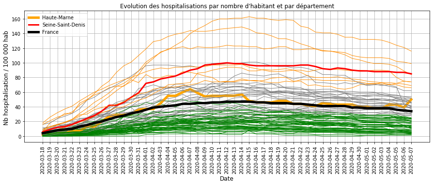
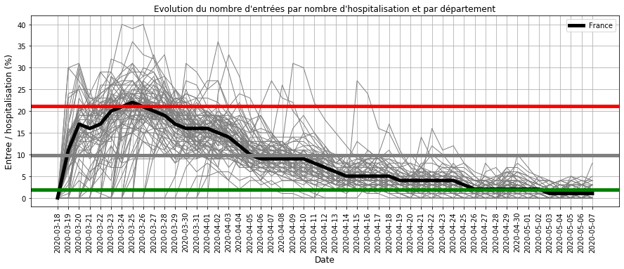
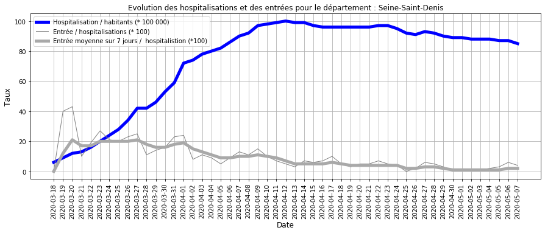
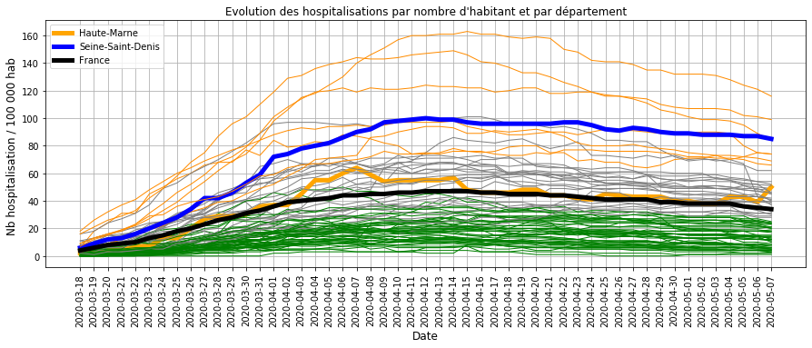
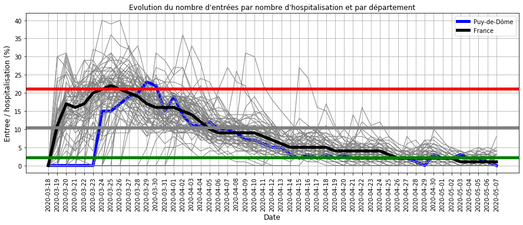
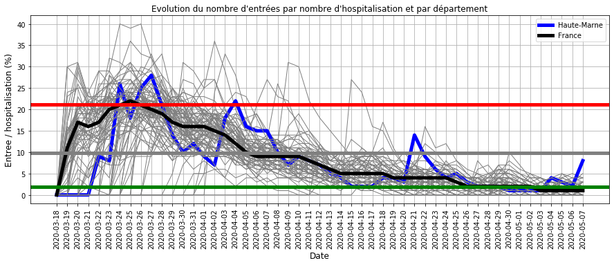

# Progression du COVID19 pendant la phase de confinement en France

## Données utilisées
- nb hospitalisation, retour à domicile et décès quotidien sur le COVID19 sur le site data.gouv.fr
- nb habitant par département

## Traitement des données

### Mise en forme des données
- analyse de la population globale sans disctinction de sexe
- calcul pour la France entière

### Calcul des indicateurs : entrées, sorties, nb entree/hosp, tendance
- entrées en hospitalisation
- sorties en hospitalisation : guérison et décès
- rapport des entrées sur le nombre d'hospitalisation (pour 100 000 habitants)
- lissage de ce rapport sur 1 semaine pour améliorer la lisibilité
- calcul de la tendance de ce rapport sur 2 semaines (pente)

     departement :  999

### Classification des départements
- par nombre d'hospitalisation (ramené à 100 000 habitant)
- par nombre d'entrées (ramené à 100 hospitalisation)

## Visualisation des résultats

###  Evolutions des hospitalisations par département
- en ROUGE, les départements où le virus se propage car le nombre d'hospitalisation et d'entrée sont elevés 
- en ORANGE, les départements pour lesquels il faut être vigilant car :
     - soit le virus se propage peu (peu d'entrée) mais le nombre d'hospitalisation est encore élevé
     - soit le nombre d'hospitalisation est dans la moyenne mais le virus se propage (beaucoup d'entrée)
 - en GRIS, les départements avec une évolution proche de la moyenne nationale (en NOIR)
 - en VERT, les département avec une évolution plus faible que la moyenne.

### Tableau détaillé des départements critiques
- hosp : nombre d'hospitalisation du département (dep)
- Thosp : nombre d'hospitalisation pour 100 000 habitants
- Treprodmoy : nombre d'entrée moyenné sur 1 semaine pour 100 hospitalisation
- tendance  : augmentation/baisse quotidienne du nombre d'entrée pour 100 hospitalisation

<table border="1" class="dataframe">
  <thead>
    <tr style="text-align: right;">
      <th></th>
      <th>dep</th>
      <th>DEP</th>
      <th>hosp</th>
      <th>Thosp</th>
      <th>Treprodmoy</th>
      <th>CTreprod</th>
      <th>tendance</th>
    </tr>
  </thead>
  <tbody>
    <tr>
      <th>4844</th>
      <td>94</td>
      <td>Val-de-Marne</td>
      <td>1623.0</td>
      <td>116</td>
      <td>1</td>
      <td>0</td>
      <td>0</td>
    </tr>
    <tr>
      <th>4742</th>
      <td>92</td>
      <td>Hauts-de-Seine</td>
      <td>1603.0</td>
      <td>99</td>
      <td>1</td>
      <td>0</td>
      <td>-6</td>
    </tr>
    <tr>
      <th>4793</th>
      <td>93</td>
      <td>Seine-Saint-Denis</td>
      <td>1379.0</td>
      <td>85</td>
      <td>2</td>
      <td>0</td>
      <td>1</td>
    </tr>
    <tr>
      <th>3875</th>
      <td>75</td>
      <td>Paris</td>
      <td>1863.0</td>
      <td>84</td>
      <td>0</td>
      <td>0</td>
      <td>-3</td>
    </tr>
    <tr>
      <th>2855</th>
      <td>55</td>
      <td>Meuse</td>
      <td>143.0</td>
      <td>74</td>
      <td>2</td>
      <td>0</td>
      <td>0</td>
    </tr>
    <tr>
      <th>4691</th>
      <td>91</td>
      <td>Essonne</td>
      <td>966.0</td>
      <td>74</td>
      <td>1</td>
      <td>0</td>
      <td>-8</td>
    </tr>
    <tr>
      <th>3467</th>
      <td>67</td>
      <td>Bas-Rhin</td>
      <td>786.0</td>
      <td>69</td>
      <td>1</td>
      <td>0</td>
      <td>0</td>
    </tr>
    <tr>
      <th>4895</th>
      <td>95</td>
      <td>Val-d'Oise</td>
      <td>818.0</td>
      <td>66</td>
      <td>1</td>
      <td>0</td>
      <td>-5</td>
    </tr>
    <tr>
      <th>2702</th>
      <td>52</td>
      <td>Haute-Marne</td>
      <td>91.0</td>
      <td>50</td>
      <td>8</td>
      <td>1</td>
      <td>16</td>
    </tr>
  </tbody>
</table>

### Commentaires à la date du 7 mai 2020 :

Les départements critiques sont :
- les 8 premiers départements ci-dessus dont le taux d'hospitalisation est élevé mais avec une tendance à la baisse.
- la Haute-Marne dont les entrées sont repartis à la hausse (ORANGE Epais sur la courbe ci-dessus)

### Evolution des entrées en hospitalisation par département

### Commentaires
2 phases dans l'évolution :
- avant fin mars : tous les départements ont eu un nombre élevé d'entrée par rapport aux hospitalisations
ce qui traduit une accélération de la circulation du virus
- après mi-avril : le nombre d'entrée a fortement baissé par rapport aux nombres d'hospitalisation
ce qui traduit une décélération de la circulation du virus

### Evolution des hospitalisations pour la France entière

### Evolution des hospitalisations sur quelques départements

#### Département de la Seine-Saint-Denis : les hospitalisations sont élevée mais la tendance est à la baisse
c'est un exemple de département dont :
- le nombre d'hospitalisation est certes élevé (BLEUE sur le deuxième graphique)
- mais le nombre d'entrée est devenu faible (GRIS sur le 1er graphique)
Ainsi la tendance est à la baisse (BLEU sur le 1er graphique)

#### Département de la Haute-Marne : les entrées repartent à la hausse
- le nombre d'entrée repart à la hausse (GRIS/BLEU sur le 1er graphique)
- Cette hausse est élevée par rapport à la tendance des autres département (BLEU 3e graphique)
- mais le nombre d'hospitalisation est encore dans la tendance moyenne (BLEU 2e graphique)

## Enregistrement

### Sous Markdown

    [NbConvertApp] Converting notebook Evolution_confinement.ipynb to markdown
    [NbConvertApp] Support files will be in Evolution_confinement_files\
    [NbConvertApp] Making directory Evolution_confinement_files
    [NbConvertApp] Making directory Evolution_confinement_files
    [NbConvertApp] Making directory Evolution_confinement_files
    [NbConvertApp] Making directory Evolution_confinement_files
    [NbConvertApp] Making directory Evolution_confinement_files
    [NbConvertApp] Making directory Evolution_confinement_files
    [NbConvertApp] Making directory Evolution_confinement_files
    [NbConvertApp] Making directory Evolution_confinement_files
    [NbConvertApp] Making directory Evolution_confinement_files
    [NbConvertApp] Writing 7161 bytes to Evolution_confinement.md
    

### Sous HTML

    [NbConvertApp] Converting notebook Evolution_confinement.ipynb to html
    [NbConvertApp] Writing 2333808 bytes to Evolution_confinement.html
    

## Fin
