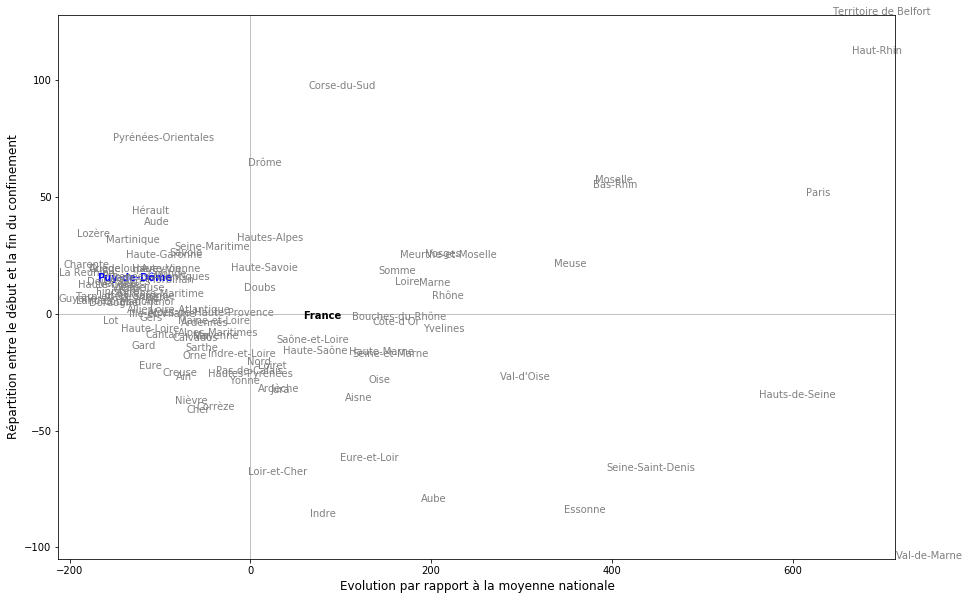
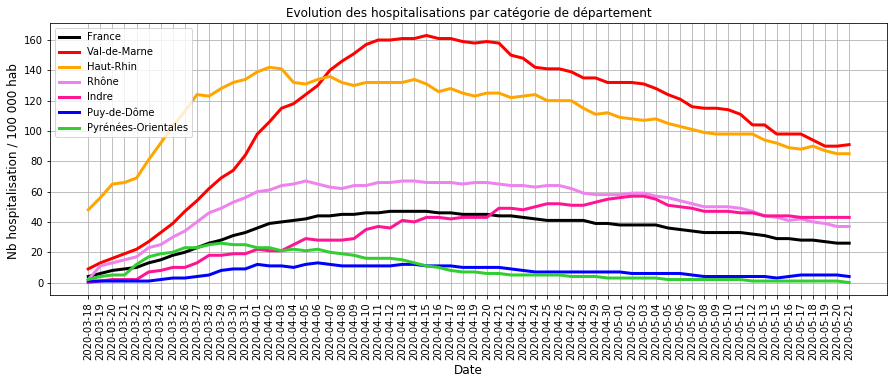

# Progression du COVID_19 pendant la phase de confinement en France

## Récupération des données
- nb hospitalisation, retour à domicile et décès quotidien sur le COVID19 sur le site data.gouv.fr
- nb habitant par département

## Traitement des données

### Préparation des données
- récupération de la population globale sans disctinction de sexe

- Calcul pour la France entière 

### Calcul des indicateurs : entrées, sorties, nb entree/hosp, tendance
- entrées en hospitalisation
- sorties en hospitalisation : guérison et décès
- rapport des entrées sur le nombre d'hospitalisation (pour 100 000 habitants)
- lissage de ce rapport sur 1 semaine pour améliorer la lisibilité
- calcul de la tendance de ce rapport sur 2 semaines (pente)

### Classification des départements
- par nombre d'hospitalisation (ramené à 100 000 habitant)
- par nombre d'entrées (ramené à 100 hospitalisation)

## Identification des différentes tendances en fin de confinement
L'objectif est d'identifier les départements les plus critiques ou ceux pour lesquels il faut rester vigilant.

###  Evolutions des hospitalisations par département
#### Legendes
La situtation des département en fin de confinement peut être rassemblée en différentes catégorie :
- en ROUGE, les départements où le virus se propage car les hospitalisations et les entrées sont elevées en fin de confinement 
- en ORANGE, les départements pour lesquels il faut être vigilant en fin de confinement car :
     - trait FIN : le virus se propage peu (entrées faibles) mais les hospitalisations sont encore élevées
     - trait EPAIS : les hospitalisations sont dans la moyenne mais les entrées élevées peuvent être le début d'une accélération     
- en GRIS, les départements avec une évolution dans la moyenne nationale (en NOIR)
- en VERT, les département avec une évolution plus faible que la moyenne.

#### Chiffres détaillés pour les départements critiques
- hosp : nombre d'hospitalisation du département (dep)
- Thosp : nombre d'hospitalisation pour 100 000 habitants
- Treprodmoy : nombre moyen d'entrée sur 1 semaine pour 100 hospitalisations

<table border="1" class="dataframe">
  <thead>
    <tr style="text-align: right;">
      <th></th>
      <th>dep</th>
      <th>DEP</th>
      <th>hosp</th>
      <th>Thosp</th>
      <th>Treprodmoy</th>
      <th>CTreprod</th>
    </tr>
  </thead>
  <tbody>
    <tr>
      <th>6079</th>
      <td>94</td>
      <td>Val-de-Marne</td>
      <td>1266.0</td>
      <td>91</td>
      <td>0</td>
      <td>0</td>
    </tr>
    <tr>
      <th>4415</th>
      <td>68</td>
      <td>Haut-Rhin</td>
      <td>661.0</td>
      <td>85</td>
      <td>1</td>
      <td>0</td>
    </tr>
    <tr>
      <th>5951</th>
      <td>92</td>
      <td>Hauts-de-Seine</td>
      <td>1242.0</td>
      <td>76</td>
      <td>0</td>
      <td>0</td>
    </tr>
    <tr>
      <th>3583</th>
      <td>55</td>
      <td>Meuse</td>
      <td>129.0</td>
      <td>67</td>
      <td>1</td>
      <td>0</td>
    </tr>
    <tr>
      <th>6015</th>
      <td>93</td>
      <td>Seine-Saint-Denis</td>
      <td>1078.0</td>
      <td>66</td>
      <td>0</td>
      <td>0</td>
    </tr>
    <tr>
      <th>5887</th>
      <td>91</td>
      <td>Essonne</td>
      <td>803.0</td>
      <td>61</td>
      <td>0</td>
      <td>0</td>
    </tr>
    <tr>
      <th>4863</th>
      <td>75</td>
      <td>Paris</td>
      <td>1307.0</td>
      <td>59</td>
      <td>0</td>
      <td>0</td>
    </tr>
    <tr>
      <th>4351</th>
      <td>67</td>
      <td>Bas-Rhin</td>
      <td>610.0</td>
      <td>53</td>
      <td>0</td>
      <td>0</td>
    </tr>
    <tr>
      <th>5823</th>
      <td>90</td>
      <td>Territoire de Belfort</td>
      <td>75.0</td>
      <td>51</td>
      <td>3</td>
      <td>0</td>
    </tr>
    <tr>
      <th>6143</th>
      <td>95</td>
      <td>Val-d'Oise</td>
      <td>616.0</td>
      <td>50</td>
      <td>0</td>
      <td>0</td>
    </tr>
    <tr>
      <th>2495</th>
      <td>38</td>
      <td>Isère</td>
      <td>112.0</td>
      <td>9</td>
      <td>6</td>
      <td>1</td>
    </tr>
    <tr>
      <th>191</th>
      <td>03</td>
      <td>Allier</td>
      <td>17.0</td>
      <td>5</td>
      <td>9</td>
      <td>1</td>
    </tr>
    <tr>
      <th>703</th>
      <td>11</td>
      <td>Aude</td>
      <td>17.0</td>
      <td>4</td>
      <td>9</td>
      <td>1</td>
    </tr>
    <tr>
      <th>6335</th>
      <td>973</td>
      <td>Guyane</td>
      <td>12.0</td>
      <td>4</td>
      <td>9</td>
      <td>1</td>
    </tr>
  </tbody>
</table>

## Commentaires sur la situation des départements à la sortie du confinement (21 mai) :

Les 10 premiers départements ci-dessus dont le nombre d'hospitalisation est le plus élevé ont une tendance à la baisse car les entrées sont faibles : cf. l'exemple qui suit sur le Val de Marne.

Le département de l'Aude, Isère, Allier et Guyane a un nombre peu élevé d'hospitalisation mais le nombre d'entrée qui repart à la hausse amène à la vigilance : cf. l'exemple qui suit sur l'Aude.

De plus il exsite de nombreux départements (VERT) qui ont été relativement peu touchés (10 fois moins).

### Evolution des entrées en hospitalisation par département

#### Courbe d'évolution pendant le confinement

#### Commentaires sur la propagation du virus en fin de confinement
2 phases dans l'évolution de la circulation pendant le confinement :
- jusqu'au 25 mars, tous les départements ont eu une augmentation significative des entrées (20 entrées pour 100 hospitalisaions) :
    - cela traduit une accélération de la circulation du virus,
    - et justifie à posteriori le passage en confinement pour la france entière,
- à partir du 15 avril, le nombre d'entrée a fortement baissé par rapport aux nombres d'hospitalisation (< 5  entrées pour 100 hospitalisations)
    - cela traduit une décroissance de la circulation du virus (4 fois moins par rapport au pic),
    - et donc montre l'impact significatif d'un confinement.

### Exemples d'évolution des hospitalisations pour les départements critiques

#### Val-de-Marne : les hospitalisations sont élevée mais la tendance est à la baisse
c'est un exemple de département dont :
- le nombre d'hospitalisation est certes élevé (BLEU sur le 1er  graphique)
- mais le nombre d'entrée est devenu faible (BLEU sur le 2ème graphique) ce qui se traduit par une tendance à la baisse

#### Département de l'Aude : une augmentation récente des entrées nécessite de la vigilence. 
- le nombre d'entrée repart à la hausse (GRIS sur le 1er graphique)
- cette hausse est élevée par rapport à la tendance des autres département (BLEU sur le 2ème graphique)
- mais le nombre d'hospitalisation est encore relativement faible (BLEU sur le 3e graphique)

## Comparaison des différentes  évolutions pendant le confinement
Cette comparaison a pour objectif de fournir une piste de reflexion pour analyser les différentes gestions du confinement dans les départements.

### Regroupement des départements par l'analyse des composantes principales
Il s'agit de rechercher quelques courbes caractéristiques de l'évolution des hospitalisations pendant le confinement dont la combinaison permettrait de décrire l'évolution de chaque département.

### Construction du modèle

### Impact des différentes composantes

    Text(0, 0.5, '% impact')

Les deux premières composantes expliquent 98 % de la courbe de l'évolution des hospitalisations de chaque département.
Les composantes suivantes sont négligeables par rapport à ces deux composantes.

### Visualisation des courbes caractéristiques qui décrivent l'évolution par département

    Text(0, 0.5, 'nb hospitalisation / 100 000 habitants')

Le poids de la première composante (courbe bleue) représente le décalage à la hausse ou à la baisse par rapport à l'évolution moyenne des hospitalisations quotidienne (courbe noire).
Cela traduit qu'un département a été  plus ou moins globalement impacté.

La deuxième composante (courbe orange) indique si un département a eu une évolution différente de la moyenne au début ou à la fin de la période :
- si le poids de la composante est positive : il y a eu une forte accélération au début et une forte décélération à la fin (cassure de la courbe plus marquée)
- si le poids de la composante est négative : il y a eu une faible accélération au début et  une faible décélération à la fin (courbe applatie)
- si le poids est nulle : la phase d'accélération au début et de décélération se rapprochent de la tendance moyenne.

### Classification des départements en fonction de la forme de l'évolution des hospitalisations

#### Poids de chaque composante par départements

#### Interprétation des différentes catégories de département : 
- en haute à droite : département fortement impacté avec une baisse relativement plus significative en fin de période (Haut-Rhin / courbe orange ci-dessous)
- en bas à droite : département fortement impacté et dont la tendance s'est relativement peu améliorée (Val-de-Marne / courbe rouge ci-dessous)
- à droite de la France : département moyennement impacté (Rhône / courbe violette)
- à gauche de la France: département peu impacté (Puy-de-Dôme / courbe bleue)
- à gauche de la France et en dessous : département dont la tendance se dégrade  (Indre / courbe rose)
- à gauche de la France et au dessus : département dont le confinement a fortement ralenti la progression (Pyrénées Orientales / courbe verte)

#### Illustration des différentes catégories de département

#### Piste de réflexion pour la suite
Alors que la situation hospitalière est proche en début de confinement (à l'exception du Haut-Rhin), cette comparaison met en évidence que malgré les règles uniformes et strictes du confinement, l'évolution des hospitalisations n'a pas été identique dans tous les départements.

La recherche des causes de cette différence est une piste pour mieux comprendre comment le confinement impacte la circulation du virus et l'évolution des hospitalisations.

## Sauvegarde des fichiers

### Sous Markdown

    [NbConvertApp] Converting notebook Evolution_confinement.ipynb to markdown
    [NbConvertApp] Support files will be in Evolution_confinement_files\
    [NbConvertApp] Making directory Evolution_confinement_files
    [NbConvertApp] Making directory Evolution_confinement_files
    [NbConvertApp] Making directory Evolution_confinement_files
    [NbConvertApp] Making directory Evolution_confinement_files
    [NbConvertApp] Making directory Evolution_confinement_files
    [NbConvertApp] Making directory Evolution_confinement_files
    [NbConvertApp] Making directory Evolution_confinement_files
    [NbConvertApp] Making directory Evolution_confinement_files
    [NbConvertApp] Making directory Evolution_confinement_files
    [NbConvertApp] Making directory Evolution_confinement_files
    [NbConvertApp] Making directory Evolution_confinement_files
    [NbConvertApp] Writing 11579 bytes to Evolution_confinement.md
    

### Sous HTML

    [NbConvertApp] Converting notebook Evolution_confinement.ipynb to html
    [NbConvertApp] Writing 2536334 bytes to Evolution_confinement.html
    

## Annexe

### Interface pour visualiser un département

    interactive(children=(Dropdown(description='dep', options=('Ain', 'Aisne', 'Allier', 'Alpes-de-Haute-Provence'…

    <function __main__.donnees_departement(dep)>

