    
    

# Surveillance du COVID-19 en France

Bonjour,

L'objectif est de calculer les indicateurs et les modèles qui permettent de suivre l'évolution de l'épidémie de Covid-19 en France :
- les chapites I,II et III présentent les données utilisées et les principes des calculs.
- les chapitres IV et V (bilan) décrivent l'évolution de l'épidémie par département.

Une mise à jour bi-mensuelle est réalisée à partir des nouvelles données hospitalières et de tests de dépistage.

## I. Origine des données
- nombre quotidien d'hospitalisation, retour à domicile et décès par département (site data.gouv.fr)
- résultat quotidien des tests de dépistage virologiques par département (site data.gouv.fr)
- nombre d'habitant par département

## II. Construction des indicateurs

    Calcul mis à jour le 2020-10-19
    

### Calcul des indicateurs par département
- taux d'hospitalisation (Thosp) : nombre d'hospitalisation pour 100 000 habitants
- taux d'entrée à l'hôpital (Treprod) : nombre d'entrée quotidienne pour 100 hospitalisations
- taux d'entrée à l'hôpital lissé (Treprodmoy) : moyenne sur 3 jours

                                                                           
    

### Classification quotidienne des départements

    
    

    Catégories pour le taux d'hospitalisation (pour 100 000 hab.) :
    très bas <  14  < bas <  34  < moyen <  62  < élevé <  104  < très élevé
    
    Catégories pour le taux d'entrée à l'hôpital (pour 100 hosp.)
    bas <  6  < élevé <  16  < très élevé 
    

### Calcul d'une alerte sur le taux d'entrée à l'hôpital
Les conditions :
- le taux d'hospitalisation n'est pas très bas (> 14 hosp. / 100 000 hab.)
- le taux d'entrée à l'hôpital est élevé (> 6 entrées / 100 hosp.)

ou
- le taux d'hospitalisation est très bas (< 14 hosp. / 100 000 hab.)
- le taux d'entrée à l'hôpital est très élevé (> 16 entrées / 100 hosp)

Cette alerte détecte une hausse significative des hospitalisations (cf. IV.B.1).

                                                                                        

### III. Relation entre les entrées à l'hôpital et les résultats des tests virologiques.

### Modélisation à partir d'une régression logistique PLS

Le modèle établit la relation entre les entrées à l'hôpital et les tests positifs pour :
- anticiper une hausse des entrées à l'hôpital,
- vérifier que les entrées à l'hôpital sont accompagnées de tests de dépistage.

La relation a été établie pendant la phase 1 et 2 du déconfinement (jusqu'au 15 juin) où les tests de dépistage sont mis en place.

**Les données explicatives** sont les taux de test positif (/ 100 000 hab.) sur les 10 derniers jours précédent l'alerte.

**Les données à prédire** sont une hausse significative des hospitalisation (alerte lorsque les entrées quotidiennes dépassent  6 entrées pour 100 hospitalisations)).

    
    

    
    

    
    

    
    

    
    

    
    

    
    

    
    

    
    

    
    

    
    

    
    
    
    

    
    

    
    

    
    

    
    

## IV. Surveillance des hospitalisations et des tests de dépistage

### A.1 - Taux d'hospitalisation
##### Description :
Le taux d'hospitalisation traduit l'importance de l'épidémie dans un département car il représente la proportion de cas graves.

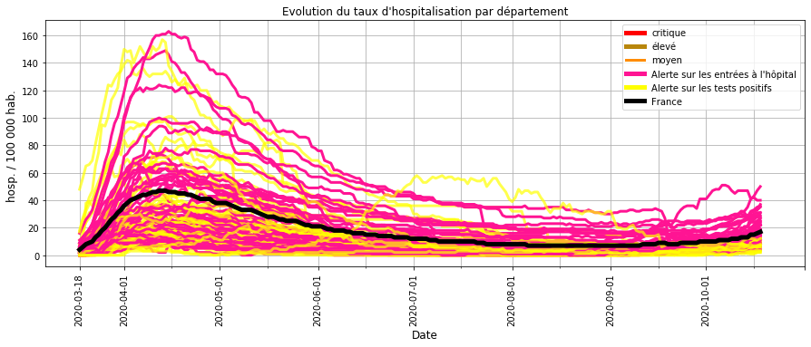

##### Commentaires :
Depuis début octobre, de nombreux départements  ont un taux d'hospitalisation qui repart à la hausse :
- soit les tests positifs sont élevés (JAUNE),
- soit les entrées hospitalières sont en augmentation (ROSE).

### A.2 - Taux d'hospitalisation les plus élevés

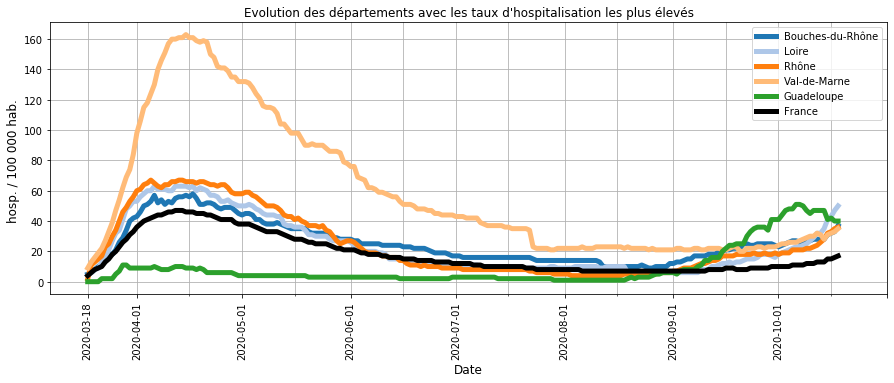

##### Commentaires : 
Pour **la Loire, le Rhône, les Bouches-du-Rhône et le Val-de-Marne**, le taux d'hospitalisation est proche de la moyenne nationale du pic d'Avril (1ère vague).

Pour **La Guadeloupe**, après un pic début octobre, la tendance est à la baisse. 

### B - Taux d'entrée à l'hôpital
##### Description :
La proportion d'entrée quotidienne à l'hôpital par rapport au nombre d'hospitalisation en cours traduit la dynamique de l'épidémie dans un département.

En effet, le nombre d'hospitalisation est proportionnel (décalé dans le temps) au nombre de contamination et les entrées à l'hôpital au nombre de nouveaux cas. Plus le rapport entre les entrées à l'hôpital et les hospitalisations est élevé, plus le rapport équivalent entre les nouveaux cas et les contaminations est élevé et donc  plus importante est la transmission du virus.

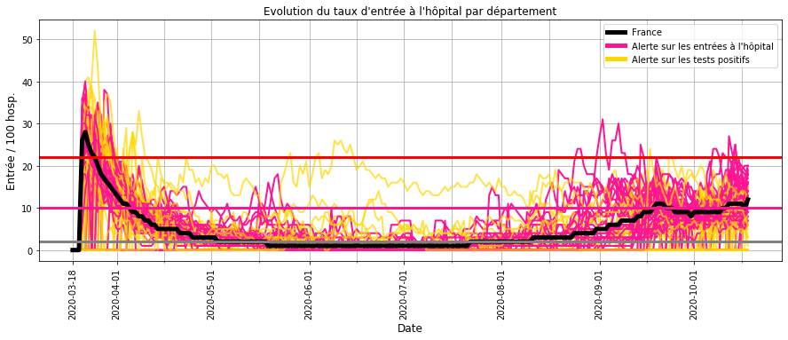

##### Commentaires :
La comparaison du taux d'entrée à l'hôpital et l'évolution du taux d'hospitalisation (cf. A.1) montre que : 
- le taux d'entrée atteint 20 % au pic de l'épidémie de début Avril (**limite Rouge**),
- il s'approche des 10 % lorsque l'épidémie à une tendance incertaine (reprise ou ralentissement) (**limite Rose**),
- il est inférieur à 5 % lorsque la vitesse de circulation du virus est faible.

Depuis le déconfinement (mai) et jusqu'à fin juillet, quelques départements ont ponctuellement un taux qui augmente.

Depuis mi-aout, la plupart des départements ont un taux d'entrée qui s'approche des 10 % et pour certains de 20 % ce qui indique une reprise plus ou moins marquée de l'épidémie.

### C - Taux de tests virologiques positifs

#### Description :

Il s'agit de surveiller l'évolution du taux de tests virologiques positifs pour anticiper l'évolution de l'épidémie.

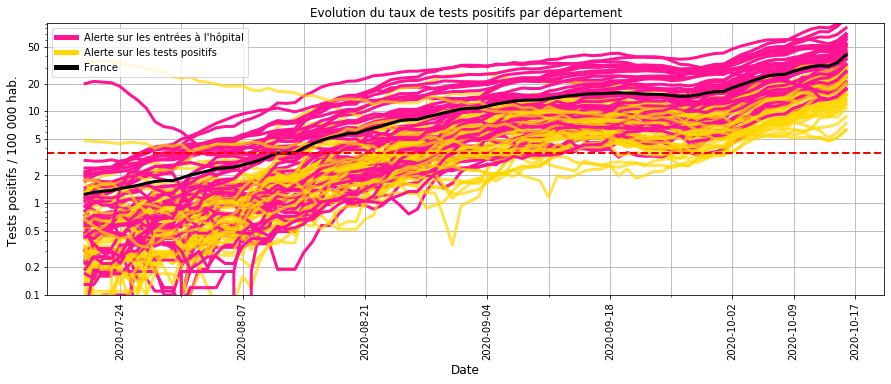

#### Commentaires :
Depuis plus de 2 mois, la moyenne nationale (NOIR) a un nombre de tests positifs supérieur au seuil d'alerte (pointillé rouge) calculé au  début du déconfinement (début mai). 

Cette hausse se traduit dans de nombreux départements par une hausse élevée des entrées à l'hôpital (courbes ROSE).

### D.1 - Alerte sur les entrées à l'hôpital
##### Description pour chaque département :
Le graphique de **gauche** permet de suivre **l'évolution hospitalière** d'un département :
- taux d'hospitalisation (BLEU) pour le département / (NOIR EPAIS) pour la France,
- taux d'entrée à l'hôpital (GRIS EPAIS) pour le département / (NOIR FIN) pour la France,
- le trait ROSE est la limite du taux d'entrée où l'épidémie s'accélère.

Le graphique de **droite** permet de suivre les **résultats des tests de dépistage** :
- nombre d'entrée à l'hôpital du département (BLEU) et de la France (NOIR EPAIS) pour 100 000 habitants,
- nombre tests positifs du département (GRIS) et de la la France (NOIR FIN) pour 100 000 habitants.

Pour faciliter l'analyse, les départements ont été regroupés en différentes catégories selon la tendance observée.

-------------------------------------------
Depuis 2 semaines, **La Loire, les Bouches-du-Rhone, le Rhône et le Val-de-Marne** ont subi une hausse très importante des hospitalisations (Bleu à gauche) et s'approche de la moyenne nationale du pic d'Avril (Noir à gauche). 

Les mesures strictes en place (couvre-feu) doivent rapidement montrer leur efficacité pour éviter leur durcissement.

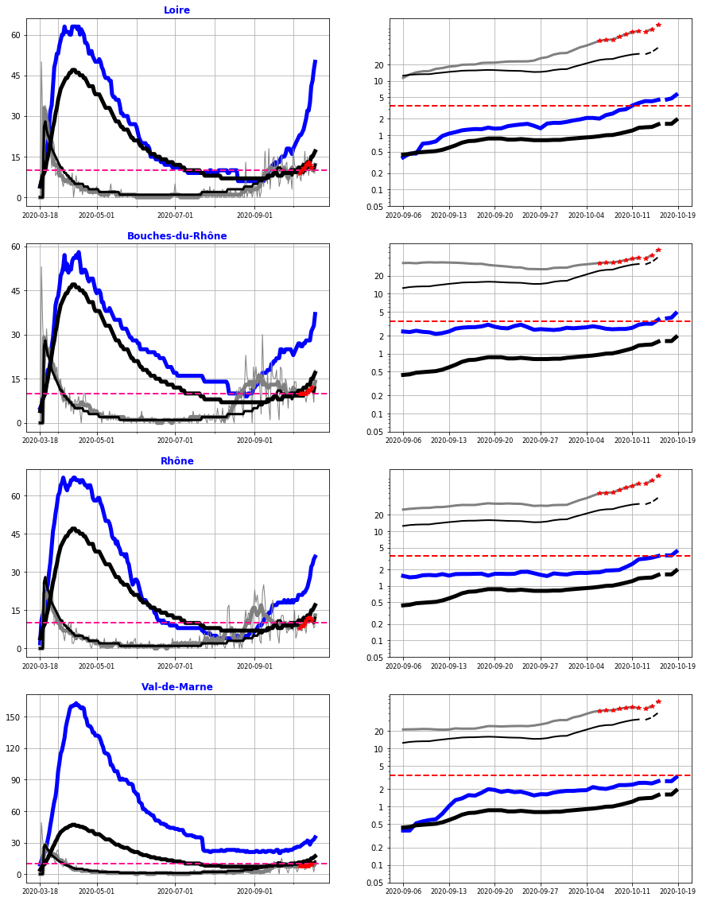

-----------------------------------------------------
**La Guadeloupe**, après une hausse des entrées hospitalières (Bleu à droite) jusqu'à fin septembre subit un ralentissement de l'épidémie. 

Les mesures strictes montrent leur effet et sont à conserver pour confirmer la baisse du taux d'hospitalisation (bleu à gauche).

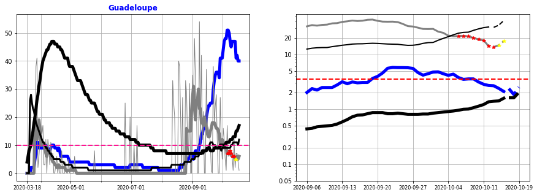

    
    

----------------------
La croissance globale des entrées hospitalières (NOIR GRAS à droite) de la **France** est exponentielle et atteindra dans 1 mois son niveau du pic d'Avril. 

C'est pourquoi dans les départements dont la hausse des entrées hospitalières est confirmée, il est nécessaire de mettre en place des mesures pour inverser la tendance.

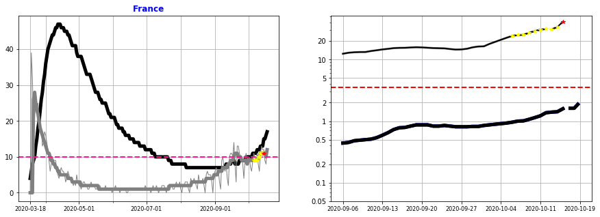

-----------------

Pour **Paris, les Hauts-de-Seine, la Seine-Maritime, le Val-d'Oise, les Yvelines, le Pas-de-Calais, l'Isère, le Nord, la Seine-Saint-Denis, l'Essonne et l'Hérault**, les entrées hospitalières sont à la hausse depuis plus de 3 semaines et l'extrapolation sur 1 mois montre que la moyenne nationale du pic d'Avril sera dépassée.

Les mesures strictes mises en place (couvre feu) sont donc justifiées.

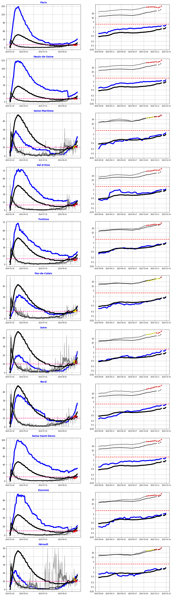

---------------
Pour **Le Puy-de-Dôme et la Saône-et-Loire**, les entrées hospitalières sont fortement à la hausse, ce qui explique la hausse rapide du taux d'hospitalisation. 

Etant donné que leur extrapolation dans 1 mois atteindra la moyenne nationale du pic d'Avril, il est nécessaire d'aligner les mesures mises en place à celles (couvre-feu) des départements les plus impactés.

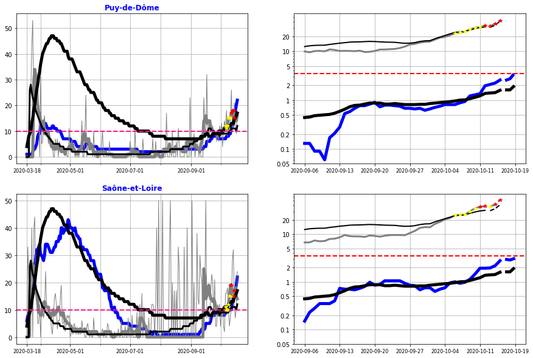

------------------------
Pour **les Hautes-Alpes, la Savoie, l'Allier et la Haute-Loire**, la tendance est fortement à la hausse depuis 10 jours.

Ces tendances sont encore trop récentes pour statuer sur les mesures les plus adéquates mais leur confirmation impliquerait de mettre en place des mesures identiques à celles (couvre-feu) des départements les plus impactés.

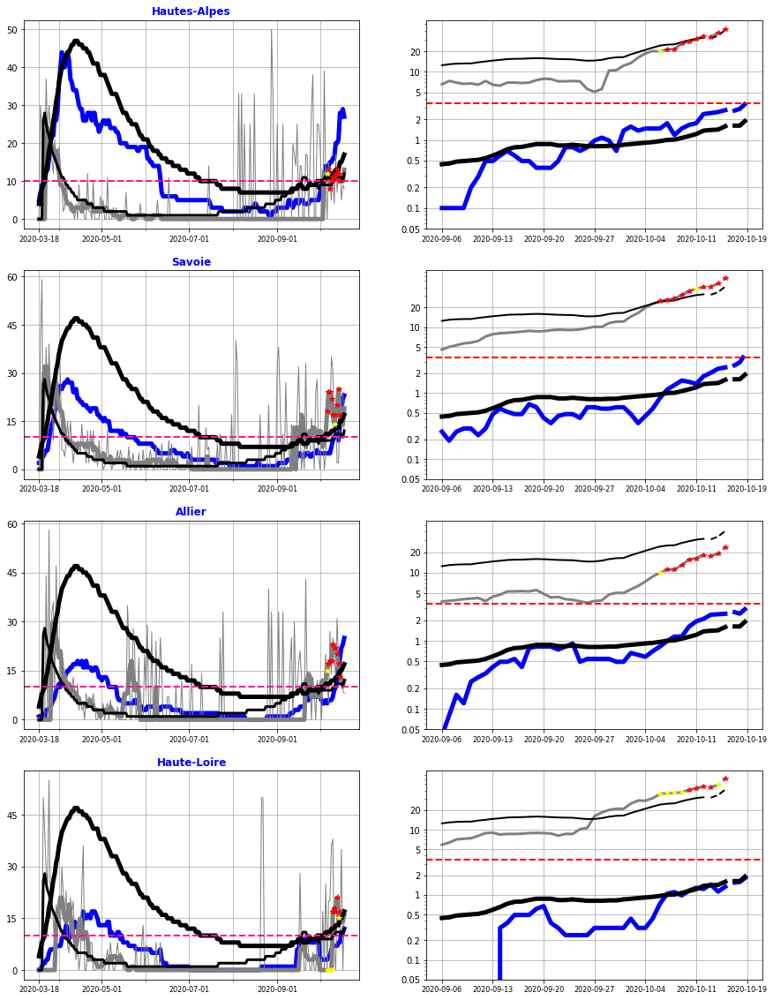

    
    

    
    

---------------------------
Pour le **Cantal et le Vaucluse**, la hausse se stabilise et ne nécessite pas de mesures supplémentaires. 

Mais cette tendance irrégulière est difficile à extrapoler et nécessite donc d'être revue régulièrement.

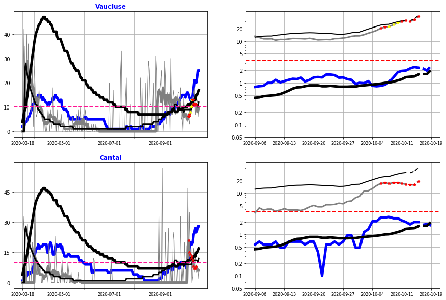

    
    

    
    

    
    

    
    

    
    

    
    

    
    

    
    

    
    

## V. Bilan sur la circulation du virus au 19 octobre 2020

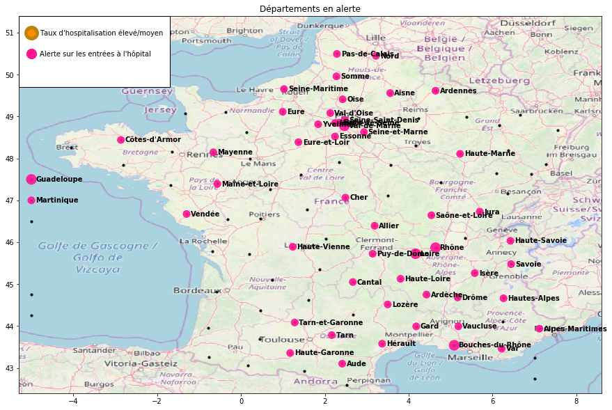

##### Commentaires

La croissance globale des entrées hospitalières de la **France** est exponentielle et une extrapolation montre que dans 1, mois le niveau du pic d'Avril sera atteint. Il est d'ailleurs déjà atteint pour les départements les plus critiques : **La Loire, les Bouches-du-Rhone, le Rhône et le Val-de-Marne** 

C'est pourquoi les mesures strictes (couvre-feu) mises en place y sont justifiées ainsi que pour les départements dont la tendance est fortement à la hausse depuis 3 semaines : **région parisienne, Seine-Maritime, Pas-de-Calais, l'Isère, Nord, et Hérault**. Seule une inversion de cette tendance d'ici 2 semaines  éviterait un durcissement de ces mesures (confinement local, ...).

Pour le **Puy-de-Dôme et la Saône-et-Loire**, la tendance est fortement à la hausse et nécessite de mettre en place des mesures identiques à celles (couvre-feu) des départements les plus impactés.

La progression récente de nombreux autres départements est à la hausse et la confirmation de cette tendance impliquera des mesures supplémentaires.

Les mesures strictes de **la Guadeloupe** doivent être maintenues pour ralentir l'épidémie.

    Merci pour votre attention.
    
