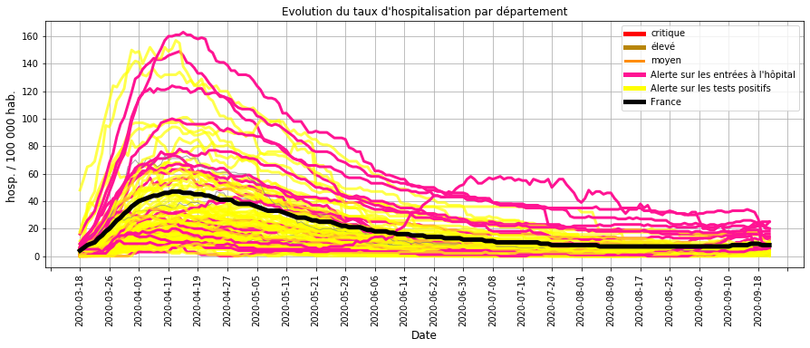
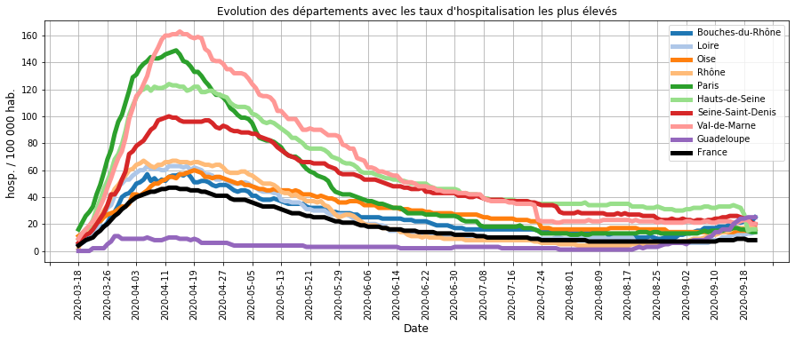
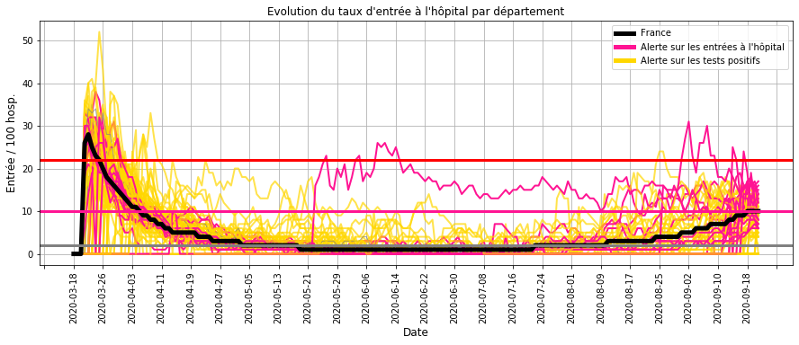
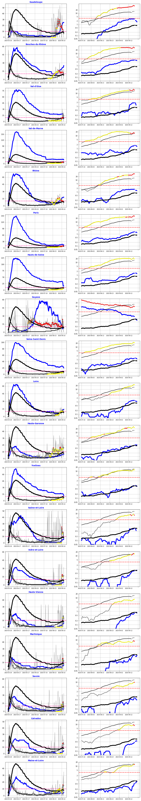
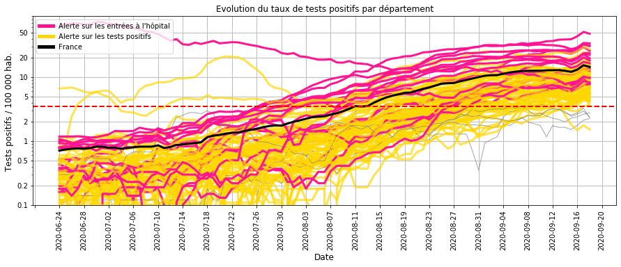
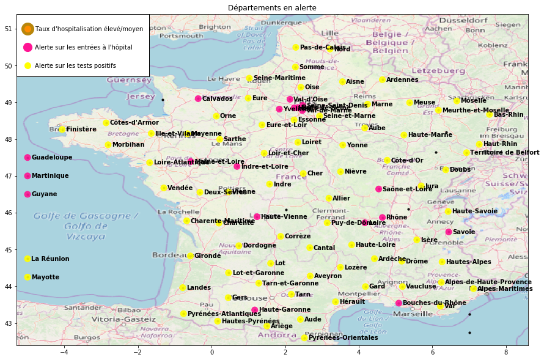

    [NbConvertApp] Converting notebook Surveillance_covid19_2020_09_21.ipynb to html
    [NbConvertApp] Writing 3795030 bytes to Surveillance_covid19_2020_09_21.html
    

# Surveillance du COVID-19 en France

Bonjour,

L'objectif est de calculer les indicateurs et les modèles qui permettent de surveiller l'évolution de l'épidémie de Covid-19 en France :
- les chapites I,II et III présentent les données utilisées et les principes des calculs.
- les chapitres IV et V (bilan) décrivent l'évolution de l'épidémie et identifient les départements à surveiller.

Une mise à jour hebdomadaire est réalisée à partir des nouvelles données hospitalières et de tests de dépistage.

## I. Origine des données
- nombre quotidien d'hospitalisation, retour à domicile et décès par département (site data.gouv.fr)
- résultat quotidien des tests de dépistage virologiques par département (site data.gouv.fr)
- nombre d'habitant par département

## II. Construction des indicateurs

### Calcul des indicateurs par département
- taux d'hospitalisation (Thosp) : nombre d'hospitalisation pour 100 000 habitants
- taux d'entrée à l'hôpital (Treprod) : nombre d'entrée quotidienne pour 100 hospitalisations
- taux d'entrée à l'hôpital lissé (Treprodmoy) : moyenne sur 3 jours

                                                                           
    

### Classification quotidienne des départements

    
    

    Catégories pour le taux d'hospitalisation (/ 100 000 hab.) :
    très bas <  14  < bas <  34  < moyen <  62  < élevé <  104  < très élevé
    
    Catégories pour le taux d'entrée à l'hôpital (/ 100 hosp.)
    bas <  6  < élevé <  16  < très élevé 
    

### Calcul d'une alerte sur le taux d'entrée à l'hôpital
Les conditions :
- le taux d'hospitalisation n'est pas bas (> 14 hosp. / 100 000 hab.)
- le taux d'entrée à l'hôpital est élevé (> 6 entrées / 100 hosp.)

ou
- le taux d'hospitalisation est bas (< 14 hosp. / 100 000 hab.)
- le taux d'entrée à l'hôpital est très élevé (> 16 entrées / 100 hosp)

Cette alerte détecte une accélération de l'épidémie (cf. IV.B.1).

                                                                                         

### III. Relation entre les entrées à l'hôpital et les résultats des tests virologiques.

### Modélisation à partir d'une régression logistique PLS

Le modèle établit la relation entre les entrées à l'hôpital et les tests positifs pour :
- anticiper une hausse des entrées à l'hôpital,
- vérifier que les entrées à l'hôpital sont accompagnées de tests de dépistage.

La relation est établie pendant la phase 1 et 2 du déconfinement (jusqu'au 15 juin) où les tests de dépistage sont en place.

**Les données explicatives** sont les taux de test positif (/ 100 000 hab.) sur les 10 derniers jours précédent l'alerte.

**Les données à prédire** sont la présence d'une alerte sur le taux d'entrée à l'hôpital (> 6 entrées / 100 hosp.).

    
    

    
    

    
    

    
    

### Interprétation du modèle

La modélisation montre que les alertes sur le taux d'entrée à l'hôpital sont liées à 3 facteurs : 
- la moyenne du taux de tests positifs sur les 10 derniers jours,
- la pente pendant ces 10 jours,
- l'allure exponentielle de la croissance.

    
    

    
    

    
    

    
    

    
    

    
    

    
    
    
    

    
    

    
    

### Précision du modèle
- Les alertes sur le taux d'entrée à l'hôpital sont en lien avec les tests positifs sur les 10 derniers jours.
- Lorsque le modèle n'explique par ces alertes, les tests de depistage ont été insuffisants.
- Lorsque le modèle propose des alertes basées sur les tests positifs sans une hausse des entrées hospitalières, celles-ci anticipent une évolution à la hausse.

Ce modèle permet de surveiller l'évolution de la circulation du virus en France à partir du 15 juin.

## IV. Surveillance des hospitalisations et des tests de dépistage

### A.1 - Taux d'hospitalisation
##### Description :
Le taux d'hospitalisation traduit l'importance de l'épidémie dans un département car il représente la proportion de cas grave en cours d'hospitalisation.

##### Commentaires :
Même si Les départements  ont un taux d'hospitalisation qui reste bas par rapport au pic de l'épidémie de début avril,
- soit le nombre de tests positifs  (JAUNE) est élevé,
- soit le nombre d'entrées à l'hôpital (ROSE) est en augmentation.

Cette tendance globale à la hausse est donc à surveiller.

### A.2 - Taux d'hospitalisation les plus élevés

##### Commentaires : 
Les départements avec les taux d'hospitalisation les plus élevés sont en augmentation mais avec des valeurs très inférieures au pic de l'épidémie d'Avril.

Seule la **Guadeloupe** a une reprise plus marquée.

### B.1 - Taux d'entrée à l'hôpital
##### Description :
Le taux d'entrée à l'hôpital traduit la dynamique de l'épidémie dans un département.

En effet, le nombre d'hospitalisation est proportionnel (décalé dans le temps) au nombre de contamination et les entrées à l'hôpital au nombre de nouveaux cas.
Plus le rapport entre les entrées à l'hôpital et les hospitalisations est élevé, plus le rapport équivalent entre les nouveaux cas et les contaminations est élevé et donc  plus importante est la transmission du virus.

##### Commentaires :
La comparaison du taux d'entrée à l'hôpital et l'évolution du taux d'hospitalisation (cf. A.1) montre que : 
- le taux d'entrée atteint 20 % au pic de l'épidémie (**limite Rouge**),
- il s'approche des 10 % lorsque l'épidémie repart ou commence à ralentir (**limite Rose**),
- il est inférieur à 5 % lorsque la vitesse de circulation du virus est faible.

Depuis le déconfinement (mai) et jusqu'à fin juillet, quelques départements ont ponctuellement un taux qui augmente.

Depuis mi-aout, la plupart des départements ont un taux d'entrée qui s'approche des 10% et donc sont à la limite d'une reprise plus marquée de l'épidémie.

### B-2 - Alerte les entrées à l'hôpital
##### Description :
Le graphique de **gauche** permet de suivre **l'évolution hospitalière** :
- taux d'hospitalisation (BLEU) pour le département / (NOIR EPAIS) pour la France,
- taux d'entrée à l'hôpital (GRIS EPAIS) pour le département / (NOIR FIN) pour la France,
- le trait ROSE est la limite du taux d'entrée où l'épidémie s'accélère.

Le graphique de **droite** permet de suivre les **résultats des tests de dépistage** :
- nombre d'entrée à l'hôpital du département (BLEU) et de la France (NOIR EPAIS) pour 100 000 habitants,
- nombre tests positifs du département (GRIS) et de la la France (NOIR FIN) pour 100 000 habitants.

Les **POINTS ROUGES** représentent les jours où le modèle génère une alerte à partir des tests positifs.

##### Commentaires :
La **Guadeloupe** a un taux d'entrée à l'hôpital qui augmente fortement depuis 2 semaines (Gris à gauche), ce qui a multiplié par 3 les hospitalisations (Bleu à gauche). L'inversion de cette tendance nécessite des mesures plus strictes.

Depuis quelques semaines, les taux élevé d'entrées à l'hôpital des  **Bouches du Rhône**, du **Rhône** entraine une hausse significative des hospitalisations (Bleu à gauche). Les mesures plus strictes mises en place récemment ont stabilisé  les entrées à l'hôpital (Bleu à droite). Cette tendance est à surveiller pour décider ou non de mesures encore plus strictes.

**Paris**, les **Yvelines**, la **Seine-saint-Denis**, les **Hauts de Seine** et la **Haute-Garonne** ont un taux élévé d'entrée à l'hôpital qui génère une légère augmentation des hospitalisation. cela ne justifie pas de mesures plus strictes.

La **Maine-et-Loire**, le **Calvados**, la **Savoie**, la **Martinique**, la **Haute-Vienne**, l'**Indre-et-Loire**, la **Saône-et-Loire**, le **Val-de-Marne**, le **Val-d'Oise** et la **Loire** ont une augmentation récente du taux d'entrée à l'hopital. Cette tendance est à confirmer ou non pour décider de mesures plus strictes.

Pour la **Guyane**, la tendance est fortement à la baisse.

### B-3 - Alerte sur les entrées à l'hôpital sans tests de dépistage massif
##### Description :
L'objectif est de vérifier que les départements dont les taux d'entrée à l'hôpital sont élevés pratiquent des tests massifs de dépistage.

    Aucun département a un taux d'entrée à l'hôpital élevé et un nombre de tests positifs faible.
    

##### Commentaires :

Contrairement au début du déconfinement où des entrées élevées à l'hôpital ne se traduisaient pas systématiquement par une hausse des tests positifs, les tests de dépistage sont généralisés à l'ensemble des départements.

### C.1 - Taux de tests virologiques positifs

#### Description :

Il s'agit de surveiller l'évolution du taux de tests virologiques positifs (pour 100 000 hab.) afin d'anticiper une éventuelle accélération de l'épidémie.

#### Commentaires :
Depuis 2 mois, la moyenne nationale (NOIR) a un nombre de tests positifs supérieur au seuil d'alerte calculé au  début du déconfinement (début mai). 

Cette hausse se traduit de plus en plus par une hausse élevée des entrées à l'hôpital.
Mais l'exemple de la Mayenne (courbe jaune élevée mi juillet) montre qu'une hausse très importante des tests positifs ne génère pas systématiquement une hausse des entrées à l'hôpital si des mesures sont mises place.

C'est pourquoi actuellement, il est difficile d'utiliser cette indicateur comme une alerte qui anticiperait l'accélération des cas graves mais plus comme une alerte incitant à suivre en détail la tendance d'un département.

    
    

    
    

## V. Bilan sur la circulation du virus au 21 septembre 2020

La hausse généralisée depuis mi-juillet des tests virologiques positifs  ne se traduit pas systématiquement par une augmentation aussi élevée des hospitalisations (c'est-à-dire des cas graves). Il est donc nécessaire d'analyser plus en détail chaque département pour décider des mesures à appliquer.

Pour la **Guyane**, L'épidémie ralentit.

La hausse des hospitalisations de la **Guadeloupe** nécessitent des mesures plus strictes.

Pour les **Bouches du Rhône** et le **Rhône**, la stabilisation récente des entrées à l'hôpital nécessite d'être confirmé pour s'assurer que les mesures strictes mises en place sont suffisantes.

**Paris, les Yvelines, la Seine-saint-Denis, les Hauts de Seine et la Haute-Garonne** ont  une hausse progressive mais légère des hospitalisations qui ne justifie pas actuellement de mesures trop restrictives (limitation des interactions sociales, confinement local) mais plus une amélioration de l'efficacité des mesures en cours (tests de dépistage et gestes barrières).

**La Maine-et-Loire, le Calvados, la Savoie, la Martinique, la Haute-Vienne, l'Indre-et-Loire, la Saône-et-Loire, le Val-de-Marne, le Val-d'Oise et la Loire** ont une augmentation récente des entrées à l'hopital dont la confirmation nécessiterait des mesures plus strictes.

    Merci pour votre attention.
    
