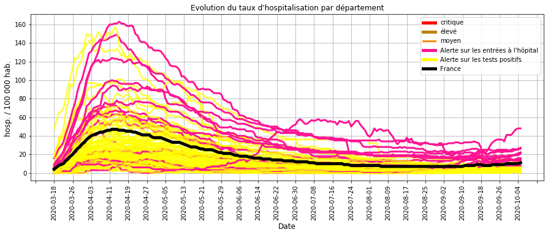
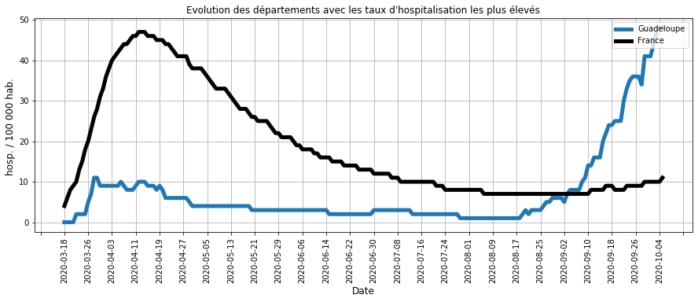
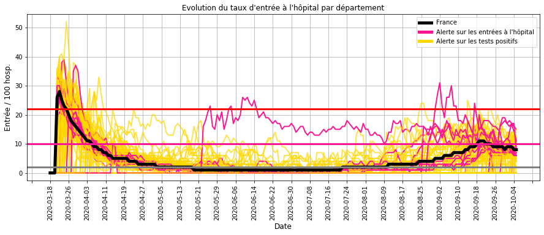
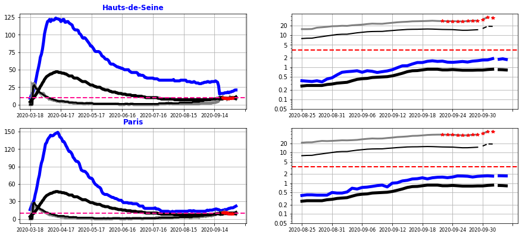
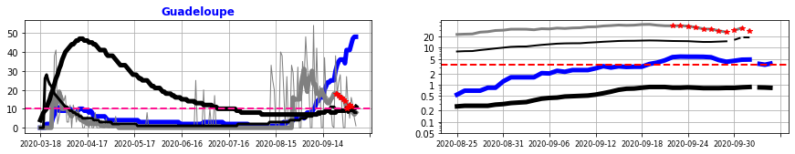
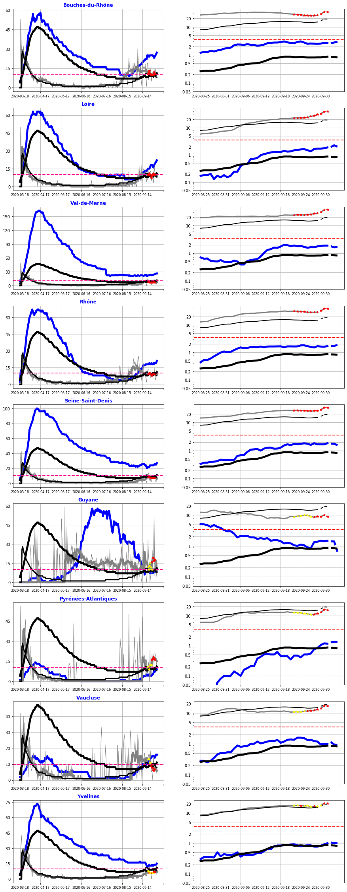
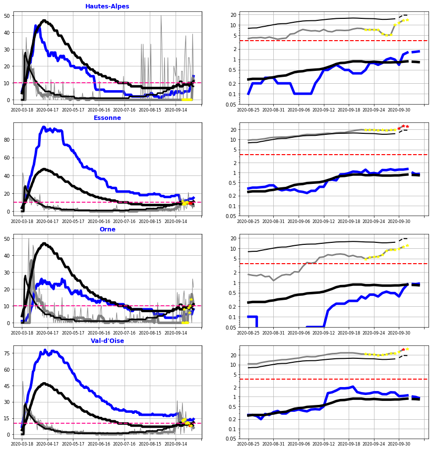
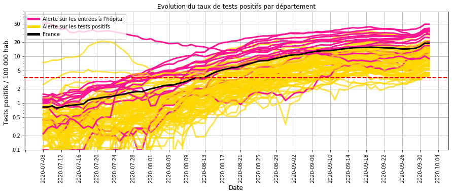
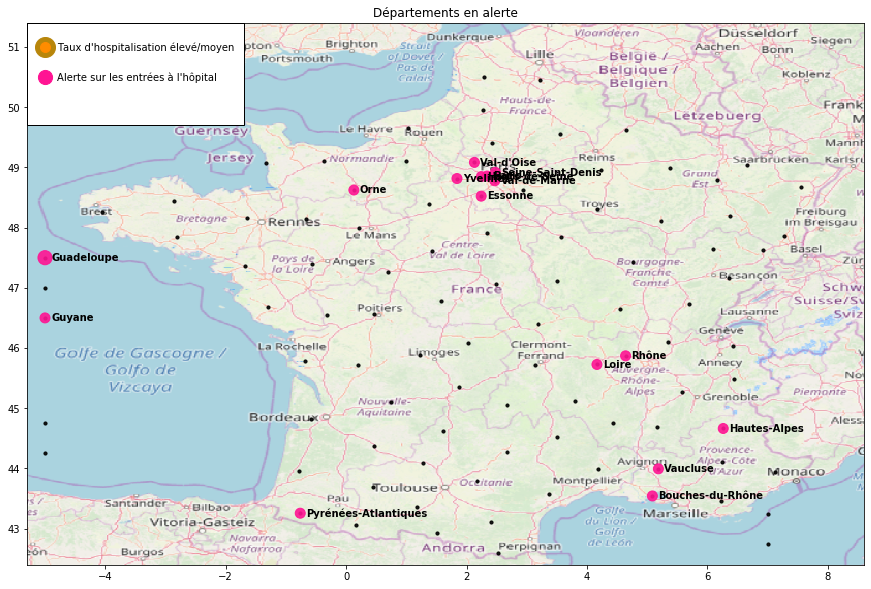

    [NbConvertApp] Converting notebook Surveillance_covid19_2020_10_06.ipynb to html
    [NbConvertApp] Writing 3219212 bytes to Surveillance_covid19_2020_10_06.html
    

# Surveillance du COVID-19 en France

Bonjour,

L'objectif est de calculer les indicateurs et les modèles qui permettent de suivre l'évolution de l'épidémie de Covid-19 en France :
- les chapites I,II et III présentent les données utilisées et les principes des calculs.
- les chapitres IV et V (bilan) décrivent l'évolution de l'épidémie par département.

Une mise à jour bi-mensuelle est réalisée à partir des nouvelles données hospitalières et de tests de dépistage.

## I. Origine des données
- nombre quotidien d'hospitalisation, retour à domicile et décès par département (site data.gouv.fr)
- résultat quotidien des tests de dépistage virologiques par département (site data.gouv.fr)
- nombre d'habitant par département

## II. Construction des indicateurs

    Calcul mis à jour le 2020-10-05
    

### Calcul des indicateurs par département
- taux d'hospitalisation (Thosp) : nombre d'hospitalisation pour 100 000 habitants
- taux d'entrée à l'hôpital (Treprod) : nombre d'entrée quotidienne pour 100 hospitalisations
- taux d'entrée à l'hôpital lissé (Treprodmoy) : moyenne sur 3 jours

                                                                           
    

### Classification quotidienne des départements

    
    

    Catégories pour le taux d'hospitalisation (pour 100 000 hab.) :
    très bas <  14  < bas <  34  < moyen <  62  < élevé <  104  < très élevé
    
    Catégories pour le taux d'entrée à l'hôpital (pour 100 hosp.)
    bas <  6  < élevé <  16  < très élevé 
    

### Calcul d'une alerte sur le taux d'entrée à l'hôpital
Les conditions :
- le taux d'hospitalisation n'est pas très bas (> 14 hosp. / 100 000 hab.)
- le taux d'entrée à l'hôpital est élevé (> 6 entrées / 100 hosp.)

ou
- le taux d'hospitalisation est très bas (< 14 hosp. / 100 000 hab.)
- le taux d'entrée à l'hôpital est très élevé (> 16 entrées / 100 hosp)

Cette alerte détecte une hausse significative des hospitalisations (cf. IV.B.1).

                                                                                        

### III. Relation entre les entrées à l'hôpital et les résultats des tests virologiques.

### Modélisation à partir d'une régression logistique PLS

Le modèle établit la relation entre les entrées à l'hôpital et les tests positifs pour :
- anticiper une hausse des entrées à l'hôpital,
- vérifier que les entrées à l'hôpital sont accompagnées de tests de dépistage.

La relation a été établie pendant la phase 1 et 2 du déconfinement (jusqu'au 15 juin) où les tests de dépistage sont mis en place.

**Les données explicatives** sont les taux de test positif (/ 100 000 hab.) sur les 10 derniers jours précédent l'alerte.

**Les données à prédire** sont une hausse significative des hospitalisation (alerte lorsque les entrées quotidiennes dépassent  6 entrées pour 100 hospitalisations)).

    
    

    
    

    
    

    
    

### Interprétation du modèle

La modélisation montre que les alertes sur le taux d'entrée à l'hôpital sont liées à 3 facteurs : 
- la moyenne du taux de tests positifs sur les 10 derniers jours,
- la pente pendant ces 10 jours,
- l'allure exponentielle de la croissance.

    
    

    
    

    
    

    
    

    
    

    
    

    
    
    
    

    
    

    
    

### Précision du modèle
Nous constatons que :
- Les alertes sur le taux d'entrée à l'hôpital sont en lien avec les tests positifs sur les 10 derniers jours.
- Lorsque le modèle n'explique par ces alertes, les tests de depistage ont été insuffisants.
- Lorsque le modèle propose des alertes basées sur les tests positifs sans une hausse des entrées hospitalières, celles-ci anticipent une évolution à la hausse.

Ce modèle permet donc d'anticiper une éventuelle accélération de la circulation du virus dans un département.

## IV. Surveillance des hospitalisations et des tests de dépistage

### A.1 - Taux d'hospitalisation
##### Description :
Le taux d'hospitalisation traduit l'importance de l'épidémie dans un département car il représente la proportion de cas grave en cours d'hospitalisation.

##### Commentaires :
A l'exception de la Guadeloupe, les départements  ont un taux d'hospitalisation qui reste bas par rapport au pic de l'épidémie de début avril,
- soit le nombre de tests positifs  (JAUNE) est élevé,
- soit le nombre d'entrées à l'hôpital (ROSE) est en augmentation.

Cette reprise globale à la hausse  est analysée par la suite.

### A.2 - Taux d'hospitalisation les plus élevés

##### Commentaires : 
Depuis 1 mois, la Guadeloupe a une hausse significative des hospitalisations, équivalente à celle de la moyenne nationale de début Avril.

### B.1 - Taux d'entrée à l'hôpital
##### Description :
Le taux d'entrée à l'hôpital traduit la dynamique de l'épidémie dans un département.

En effet, le nombre d'hospitalisation est proportionnel (décalé dans le temps) au nombre de contamination et les entrées à l'hôpital au nombre de nouveaux cas.
Plus le rapport entre les entrées à l'hôpital et les hospitalisations est élevé, plus le rapport équivalent entre les nouveaux cas et les contaminations est élevé et donc  plus importante est la transmission du virus.

##### Commentaires :
La comparaison du taux d'entrée à l'hôpital et l'évolution du taux d'hospitalisation (cf. A.1) montre que : 
- le taux d'entrée atteint 20 % au pic de l'épidémie (**limite Rouge**),
- il s'approche des 10 % lorsque l'épidémie à une tendance incertaine (reprise ou ralentissement) (**limite Rose**),
- il est inférieur à 5 % lorsque la vitesse de circulation du virus est faible.

Depuis le déconfinement (mai) et jusqu'à fin juillet, quelques départements ont ponctuellement un taux qui augmente.

Depuis mi-aout, la plupart des départements ont un taux d'entrée qui s'approche des 10 %, ce qui indique une reprise plus ou moins marquée de l'épidémie.

### B-2 - Alerte sur les entrées à l'hôpital
##### Description :
Le graphique de **gauche** permet de suivre **l'évolution hospitalière** d'un département :
- taux d'hospitalisation (BLEU) pour le département / (NOIR EPAIS) pour la France,
- taux d'entrée à l'hôpital (GRIS EPAIS) pour le département / (NOIR FIN) pour la France,
- le trait ROSE est la limite du taux d'entrée où l'épidémie s'accélère.

Le graphique de **droite** permet de suivre les **résultats des tests de dépistage** :
- nombre d'entrée à l'hôpital du département (BLEU) et de la France (NOIR EPAIS) pour 100 000 habitants,
- nombre tests positifs du département (GRIS) et de la la France (NOIR FIN) pour 100 000 habitants.

Les **POINTS ROUGES** représentent les jours où le modèle génère une alerte à partir des tests positifs.

Pour faciliter l'analyse, les départements ont été regroupés en différentes catégories selon la tendance observée.

    Alerte  avec une progression régulière
    
    Hauts-de-Seine       Hosp :  21 | Treprod : 10 % | Prog. hebdo :  12 %| Entree :  1.9 | +1 mois :  2.9 | R2 : 0.7   | DW : 0.8
    Paris                Hosp :  22 | Treprod :  9 % | Prog. hebdo :  10 %| Entree :  1.7 | +1 mois :  2.7 | R2 : 0.79  | DW : 1.1
    

##### Commentaires :

Les **Hauts-de-Seine** et **Paris** ont un taux d'hospitalisation bas (bleu à gauche) mais une tendance régulière à la hausse des entrées hospitalières (bleu à droite) depuis plusieurs semaines.

L'extrapolation des courbes sur 1 mois indique que le niveau d'entrée à l'hôpital (< 3 entrées pour 100 000 hab.) n'atteindra pas le niveau du pic d'Avril (environs 4 entrées pour 100 000 hab.).

Sachant que le temps de réaction de mesures strictes (confinement local ou limitation des interactions sociales) est d'environs deux semaines, il est encore possible d'inverser la tendance en améliorant l'efficacité de mesures moins contraignantes (gestes barrières, isolement par tests de dépistage).

    Alerte avec un taux d'hospitalisation moyen ou élevé
    
    Guadeloupe           Hosp :  48 | Treprod : 11 % | Entree :  4.8 | R2 : 0.1   | DW : 0.2 | prog. :   9 % | S-1 : -22 %
    

##### Commentaires :

La **Guadeloupe** a eu un taux d'hospitalisation qui a augmenté fortement (bleu à gauche) depuis 3 semaines.
Actuellement, les entrées quotidiennes à l'hopital (bleu à droite) se stabilisent.

Les mesures strictes commencent à stabiliser la progression mais celles-ci doivent être maintenues pour envisager un ralentissement de l'épidémie.

    Alerte avec un taux d'entrée très élevé
    
    RAS
    

    Alerte confirmée avec une progression faible et irrégulière
    
    Bouches-du-Rhône     Hosp :  27 | Treprod : 11 % | Entree :  2.6 | R2 : 0.08  | DW : 0.9 | prog. :  -2 % | S-1 :  18 %
    Loire                Hosp :  22 | Treprod : 10 % | Entree :  1.9 | R2 : 0.86  | DW : 1.4 | prog. :  19 % | S-1 :  34 %
    Val-de-Marne         Hosp :  26 | Treprod :  7 % | Entree :  1.9 | R2 : 0.03  | DW : 0.6 | prog. :   2 % | S-1 : -11 %
    Rhône                Hosp :  21 | Treprod :  9 % | Entree :  1.7 | R2 : 0.09  | DW : 1.2 | prog. :   2 % | S-1 :  12 %
    Seine-Saint-Denis    Hosp :  27 | Treprod :  7 % | Entree :  1.8 | R2 : 0.48  | DW : 0.6 | prog. :  12 % | S-1 :  -2 %
    Guyane               Hosp :   8 | Treprod : 18 % | Entree :  1.5 | R2 : 0.06  | DW : 0.9 | prog. :  -6 % | S-1 : -44 %
    Pyrénées-Atlantiques Hosp :   9 | Treprod : 16 % | Entree :  1.2 | R2 : 0.7   | DW : 0.4 | prog. :  53 % | S-1 :  63 %
    Vaucluse             Hosp :  16 | Treprod :  7 % | Entree :  1.0 | R2 : 0.3   | DW : 0.6 | prog. : -10 % | S-1 : -14 %
    Yvelines             Hosp :  15 | Treprod :  7 % | Entree :  1.0 | R2 : 0.39  | DW : 0.7 | prog. :   8 % | S-1 :  37 %
    

##### Commentaires :

En extrapolant la progression régulière et à la hausse des entrées hospitalières de la **Loire**,  le niveau du pic d'Avril est atteint dans 1 mois. Les mesures actuelles doivent inverser la tendance pour éviter des mesures plus strictes.

Le taux d'hospitalisations **des Pyrénées-Atlantiques** (bleu à gauche) a doublé en 1 semaine mais reste à un niveau très bas : une confirmation de cette tendance est nécessaire avant d'envisager des mesures plus strictes.

**Les Bouches-du-Rhône, le Val-de-Marne, le Rhône, la Seine-Saint-Denis et les Yvelines** ont un taux d'hospitalisation encore bas avec une stabilisation des entrées hospitalières (bleu à droite) : une amélioration de l'efficacité des mesures actuelles peut suffire à faire baisser les hospitalisations.

Après une tendance à la baisse depuis plusieurs semaines, **La Guyane** a eu une hausse récente mais très ponctuelle des entrées hospitalières (bleu à droite). Les prochaines semaines permettront de s'assurer que la tendance à la baisse se poursuit.

Après une hausse de 5 semaines, les entrées hospitalières **du Vaucluse**  sont à la baisse depuis 10 jours.

    Alerte récente
    
    Hautes-Alpes         Hosp : 14 | Treprod : 0 % | Tentree : 1.6
    Essonne              Hosp : 15 | Treprod : 9 % | Tentree : 1.3
    Orne                 Hosp : 8 | Treprod : 14 % | Tentree : 0.9
    Val-d'Oise           Hosp : 14 | Treprod : 8 % | Tentree : 1.1
    

##### Commentaires :

Le taux d'hospitalisation de **l'Essonne** repart à la hausse mais reste très bas et la progression des entrées hospitalières est quasi-stable. 

**Les Hautes-Alpes** et **l'Orne** ont une augmentation récente des entrées hospitalières avec une niveau très bas d'hospitalisation.

**Le Val-d'Oise** a une tendance incertaines avec :
- un niveau d'hospitalisation encore très bas qui augmente légèrement,
- et des entrées hospitalièress qui baissent légèrement.

La tendance à la hausse de ces départements est donc récente et n'est pas critique actuellement.

### B-3 - Alerte sur les entrées à l'hôpital sans tests de dépistage massif
##### Description :
L'objectif est de vérifier que les départements dont les taux d'entrée à l'hôpital sont élevés pratiquent des tests massifs de dépistage.

    RAS
    

##### Commentaires :

Contrairement au début du déconfinement où des entrées élevées à l'hôpital ne se traduisaient pas systématiquement par une hausse des tests positifs, les tests de dépistage sont généralisés à l'ensemble des départements.

### C.1 - Taux de tests virologiques positifs

#### Description :

Il s'agit de surveiller l'évolution du taux de tests virologiques positifs pour identifier une éventuelle reprise de l'épidémie.

#### Commentaires :
Depuis de 2 mois, la moyenne nationale (NOIR) a un nombre de tests positifs supérieur au seuil d'alerte (pointillé rouge) calculé au  début du déconfinement (début mai). 

Cette hausse se traduit de plus en plus par une hausse élevée des entrées à l'hôpital.
Mais l'exemple de la Mayenne (courbe jaune élevée mi juillet) montre qu'une hausse très importante des tests positifs ne génère pas systématiquement une hausse des entrées à l'hôpital si des mesures sont mises place.

C'est pourquoi actuellement, il est difficile d'utiliser cette indicateur comme une anticipation de l'évolution des cas graves mais plus comme une alerte incitant à suivre en détail la tendance d'un département.

    
    

    
    

## V. Bilan sur la circulation du virus au 5 octobre 2020

La hausse généralisée depuis mi-juillet des tests virologiques positifs ne se traduit pas systématiquement par une augmentation aussi élevée des hospitalisations (c'est-à-dire des cas graves). Il est donc nécessaire d'analyser chaque département pour décider des mesures à appliquer.

Les mesures strictes de **la Guadeloupe** doivent être maintenues pour ralentir l'épidémie.

**Les Hauts-de-Seine, Paris, la Loire, les Bouches-du-Rhône, le Val-de-Marne, le Rhône, la Seine-Saint-Denis et les Yvelines** nécessitent une plus grande efficacité des mesures actuelles (geste barrières ou isolement à partir d'un dépistage massif) pour éviter des mesures complémentaires plus strictes (reconfinement local ou limitation des interactions sociales).

La progression récente **des Pyrénées-Atlantiques, de l'Essonne, les Hautes-Alpes, l'Orne et le Val-d'Oise** est à confirmer avant de statuer sur des mesures complémentaires.

Les tendances de **la Guyane** et du **Vaucluse** sont à la baisse depuis plusieurs semaines.

    Merci pour votre attention.
    
