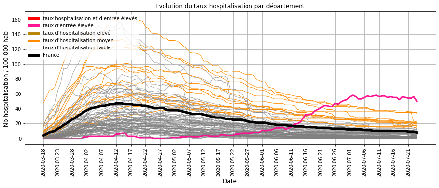
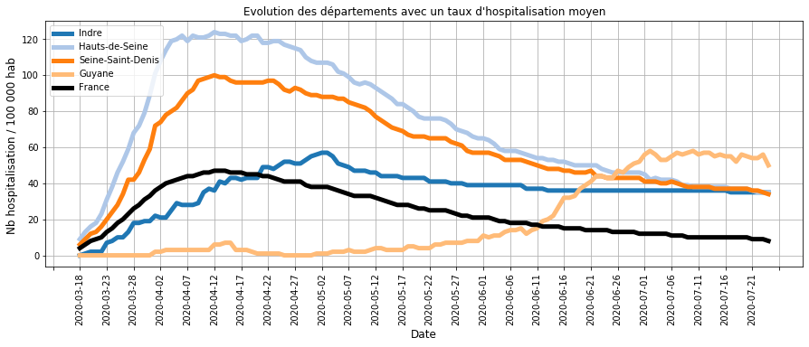
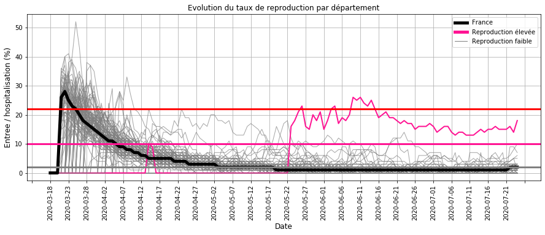
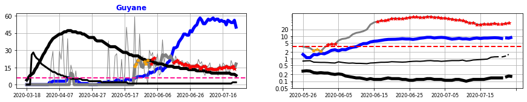
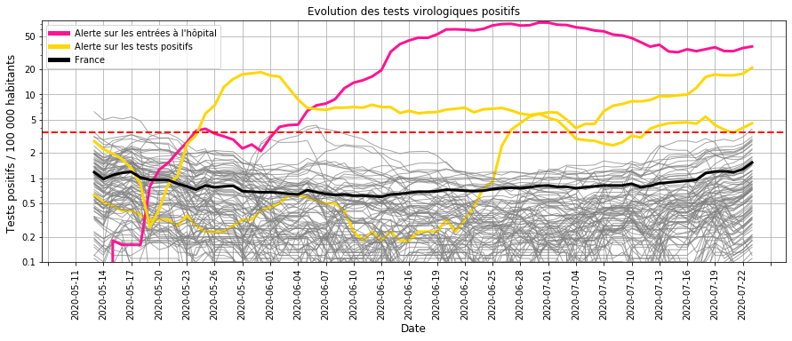
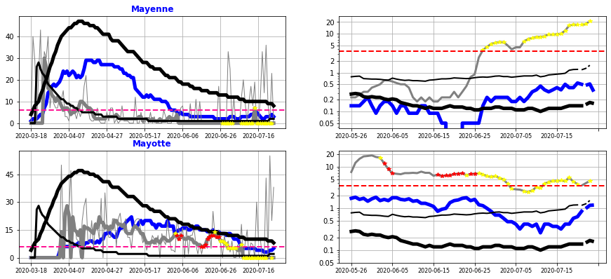
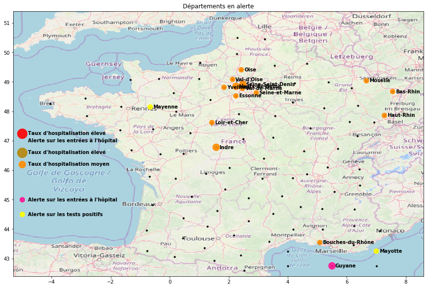

    
    

# Surveillance du COVID_19 en France

Bonjour,

L'objet de cette étude est de calculer les indicateurs et les modèles qui permettent de surveiller l'évolution de l'épidémie de Covid-19 en France :
- les chapites I,II et III présentent les données utilisées et les principes des calculs.
- les chapitres IV et V (bilan) décrivent l'évolution de l'épidémie et identifient les départements à surveiller.

Une mise à jour hebdomadaire est réalisée à partir des nouvelles données hospitalières et de tests de dépistage.

## I. Origine des données
- nombre d'hospitalisation, retour à domicile et décès quotidien et par département sur le COVID-19 sur le site data.gouv.fr
- Nombre et résultat des tests de dépistage virologiques quotidiens par département sur le COVID-19 sur le site data.gouv.fr
- nombre d'habitant par département

## II. Construction des indicateurs

### Calcul des indicateurs par département
- taux d'hospitalisation (Thosp) : nombre d'hospitalisation pour 100 000 habitant
- taux d'entrée à l'hôpital (Treprod) : nombre d'entrée quotidienne pour 100 hospitalisations
- taux d'entrée à l'hôpital lissé (Treprodmoy) : moyenne du taux d'entrée sur 3 jours

                                                                           alcul entree : Landes                              lissage entree : Bouches-du-Rhône                              
    

### Classification quotidienne des départements
- taux d'hospitalisation  (CThosp) : regroupement en 5 catégories (très bas, bas, moyen, élevé, très élevé) pour situer le niveau des hospitalisations,
- taux d'entrée à l'hôpital (CTreprod) : regroupement en 3 catégories (bas, élevé, très élevés) pour indiquer une tendance est à la hausse ou à la baisse.

    Catégorie pour le taux d'hospitalisation (pour 100 000 habitants) :
    très bas <  14  < bas <  34  < moyen <  62  < élevé <  104  < très élevé
    
    Catégorie pour le taux d'entrée à l'hôpital (pour 100 hospitalisation)
    bas <  6  < élevé <  16  < très élevé 
    

### Calcul d'une alerte sur le taux d'entrée à l'hôpital
Les conditions :
- le taux d'hospitalisation n'est pas bas (> 14 hospitalisations / 100 000 habitants)
- le taux d'entrée à l'hôpital est élevé (> 6 entrées quotidiennes / 100 hospitalisations)

ou
- le taux d'hospitalisation est bas
- le taux d'entrée à l'hôpital est très élevé (> 16 %)

Cette alerte traduit une forte croissance de l'épidémie.

                                                                                         

### III. Modélisation de la relation entre les entrées à l'hôpital et les résultats des tests virologiques.

### Modélisation à partir d'une régression logistique PLS

**Le modèle** établit la relation entre les nouvelles entrées à l'hôpital et les tests positifs qui permettra :
- d'anticiper les entrées à l'hôpital,
- de vérifier que les entrées à l'hôpital sont accompagnées de tests de dépistage afin d'isoler les chaines de contamination.

**La période** pour établir la relation a été la phase 1 et 2 du déconfinement (jusqu'au 15 juin) où 
- les tests de dépistage sont massivement en place,
- la circulation du virus était encore élevée.

**Les données à expliquer** sont la présence ou non par département d'une alerte sur le taux quotidien d'entrées à l'hôpital (> 6 entrées pour 100 hospitalisations).

**Les données explicatives** sont les taux de test positif (pour 100 000 habitants) sur les 10 derniers jours précédent cette alerte. 

    
    

    
    

    
    

    
    

### Résultats de la régression logistique PLS

La modélisation montre que les alertes sur le taux d'entrée à l'hôpital sont liées à 3 facteurs : 
- la moyenne du taux de tests positifs sur les 10 derniers jours,
- leur augmentation pendant ces 10 jours,
- la forme exponentielle de cette croissance.

    
    

    
    

    
    

    
    

    
    

    
    

    
    
    
    

    
    

    
    

### Bilan sur la précision du modèle
- Les alertes sur le taux d'entrée à l'hôpital sont en lien avec les tests positifs sur les 10 derniers jours.
- Lorsque le modèle n'explique par ces alertes, les tests de depistage ont été insuffisants.
- Lorsque le modèle propose des alertes basées sur les tests positifs sans hausse des entrées hospitalières, celles-ci anticipent une évolution à la hausse : elles restent donc pertinente.

Il a été décidé de retenir ce modèle comme un moyen supplémentaire de surveiller l'évolution de la circulation du virus en France à partir du 15 juin.

    array([0.98264669, 1.17424053, 1.38982522, 2.43304203, 2.79806492,
           2.98454016, 2.94136496, 3.54292551, 4.95047857,        nan])

## IV. Surveillance des hospitalisations et des tests de dépistage

### Taux d'hospitalisation par département
##### Description :
Ce taux d'hospitalisation traduit l'importance de l'épidémie dans un département car il représente la proportion de cas grave.

- en NOIR       : la France
- en ORANGE FIN : départements dont le taux d'hospitalisation est à un niveau moyen
- en GRIS       : départements dont le taux d'hospitalisation est à un niveau bas
- en ROSE       : départements dont les taux d'entrée à l'hôpital sont élevées (ce qui traduit une croissance de l'épidémie)

##### Commentaires :
- la majorité des départements (GRIS/ORANGE) ont des valeurs très faibles par rapport au pic de l'épidémie de début avril,
- seule la Guyane (ROSE) a un taux d'hospitalisation élevé et quasiment stable.

###  Départements dont les taux d'hospitalisation sont les plus élevés

##### Commentaires : 
Les départements dont les taux d'hospitalisation sont les plus élevés sont à la baisse et très inférieurs aux valeurs du pic de l'épidémie début Avril.

Seule la **Guyane** a un taux d'hospitalisation qui a récemment augmenté et dépassé le niveau moyen du pic de l'épidémie.

### Taux d'entrée à l'hôpital par département
##### Description :
Le taux d'entrée à l'hôpital est un indicateur significatif de la dynamique de l'épidémie.

En effet, le nombre d'hospitalisation est proportionnel (décalé dans le temps) au nombre de contamination et les entrées à l'hôpital au nombre de nouveaux cas.
Plus le rapport entre les entrées à l'hôpital et les hospitalisations est élevé, plus le rapport équivalent entre les nouveaux cas et les contaminations est élevé et donc la transmission du virus plus importante.

Le graphique montre l'évolution des départements :
- En GRIS : le taux d'entrée est bas,
- EN NOIR : la France,
- En ROSE : le taux d'entrée est élevé.

##### Commentaires :
L'analyse de l'épidémie montre que ce taux d'entrée à l'hôpital : 
- atteint 20 % au pic de l'épidémie (**limite Rouge**),
- s'approche des 10 % lorsque l'épidémie repart ou commence à ralentir (**limite Rose**),
- est inférieur à 5 % lorsque la circulation du virus est très faible.

Depuis le déconfinement (mai), quelques départements ont ponctuellement un taux qui s'approche de la limite où l'épidémie s'accélère (Limite ROSE),

Seule **la Guyane** (en ROSE) présente actuellement un taux élevé depuis fin mai, analysé par la suite.

### Départements dont les taux d'entrée à l'hôpital sont élevés.
##### Description :
le graphique de gauche permet de suivre l'évolution hospitalière :
- le taux d'hospitalisation en BLEU pour le département et en NOIR EPAIS pour la France,
- le taux d'entrée à l'hôpital en GRIS EPAIS pour le département et en NOIR FIN pour la France,
- le trait ROSE est la limite du taux d'entrée au delà de laquelle l'épidémie s'accélère.

Le graphique de droite permet de suivre les résultats des tests de dépistage
- nombre d'entrée à l'hôpital du département (BLEU) et de France (NOIR EPAIS) pour 100 000 habitants,
- nombre tests positifs du département (GRIS) et de la France (NOIR FIN) pour 100 000 habitants.

Les **POINTS ROUGES** représentent les jours où le modèle génère une alerte à partir des tests positifs.

##### Commentaires :
**La Guyane** a un taux d'entrée à l'hôpital (GRIS FONCE à gauche) élevé depuis fin mai qui se traduit par une forte augmentation du taux d'hospitalisation (BLEU à gauche) au delà du pic épidémique en France (mi-avril).

La baisse du taux d'entrée à l'hôpital depuis mi-juin (25 à 15 %) indique que des mesures plus strictes ralentissent la circulation du virus. Mais elles sont encore insuffisantes pour ralentir fortement l'épidémie.

La hausse des tests positifs depuis début juin (GRIS à droite) montre que les tests de dépistage sont en place.

### Taux de tests virologiques positifs

#### Description:

#### Commentaires :

### Départements dont les taux de test positif sont élevés
##### Description :
L'objectif est de recenser les départements dont les tests positifs augmentent alors que le taux d'entrée à l'hôpital reste encore faible.
Cela permet d'anticiper une accélération de l'épidémie.

Le graphique de gauche permet de suivre l'évolution hospitalière :
- le taux d'hospitalisation en BLEU pour le département et en NOIR EPAIS pour la France,
- le taux d'entrées à l'hôpital en GRIS EPAIS pour le département et en NOIR FIN pour la France,
- le trait ROSE est la limite du taux d'entrée au delà de laquelle l'épidémie s'accélère.

Le graphique de droite permet de suivre les résultats des tests de dépistage
- nombre d'entrée à l'hôpital du département (BLEU) et de France (NOIR EPAIS) pour 100 000 habitants,
- nombre de tests positifs du département (GRIS) et de la France (NOIR FIN) pour 100 000 habitants.

Les **POINTS JAUNE** représentent les jours où le modèle génère une alerte sur les tests positifs.

##### Commentaires :
**La mayenne** a une hausse des tests positifs (GRIS à droite) depuis fin juin sans être accompagnée d'une hausse aussi importante des entrées hospitalières (BLEU à droite). Il n'y a donc pas encore une forte accélération de l'épidémie sur les cas graves. La poursuite des tests de dépistage pour isoler les chaines de contaminations et des mesures barrières permettent de maintenir un haut niveau de vigilance.

**Mayotte** a encore un taux de tests positifs élevé mais la tendance est à la baisse depuis quelques semaines .

### Départements dont les tests de dépistage sont insuffisants
##### Description :
L'objectif est de vérifier que les départements dont les taux d'entrée à l'hôpital sont élevés pratiquent des tests massifs de dépistage.

    Il n'a pas été identifié de département dont le taux d'entrée à l'hôpital est élevés et le nombre de tests positifs faible
    

##### Commentaires :

Il faut rappeler que fin mai, l'Allier et la Creuse n'avaient pas fait l'objet de tests de dépistage massifs suite à une recrudescence des entrées à l'hôpital.

## V. Bilan sur la circulation du virus au 24 juillet 2020 :
La majorité des départements ont une chute du nombre d'hospitalisation, ce qui traduit globalement une faible circulation du virus.
13 départements (en ORANGE sur la carte) ont encore taux d'hospitalisation moyen.

Depuis le déconfinement, certains départements ont ponctuellement un taux d'entrée à l'hôpital en hausse. Un système de surveillance est nécessaire pour s'assurer que ces derniers ne persistent pas : l'exemple de la Creuse et de l'Allier dont la hausse des entrées à l'hôpital fin mai ne s'est pas traduit par une hausse des tests virologiques positifs montre qu'il est nécessaire de renforcer la mise en oeuvre de ce système de dépistage.

**La Guyane** avec une hausse des hospitalisations depuis 2 mois a subit une accélération de la circulation du virus. Des mesures récentes plus strictes commencent à montrer leur effet sur la diminution des entrées hospitalières. Celle-ci n'a pas encore atteint la limite indiquant un fort ralentissement de l'épidémie :  le nombre encore élevé de tests positifs le confirme.

Depuis 1 mois la **Mayenne** a une hausse des tests positifs sans une hausse équivalente des entrées hospitalières. Certes cela ne permet pas de conclure à une forte accélération de l'épidémie mais nécessite une surveillance accrue par un dépistage massif et l'application rigoureuse des mesures barrières.

**Mayotte** a depuis quelques semaines une tendance à la baisse même si les tests positifs restent élevés.

    Merci pour votre attention.
    

    interactive(children=(Dropdown(description='dep', index=101, options=('Ain', 'Aisne', 'Allier', 'Alpes-de-Haut…

    interactive(children=(Dropdown(description='date', index=70, options=('2020-05-11', '2020-05-12', '2020-05-13'…

    interactive(children=(Dropdown(description='departement', index=53, options=('Ain', 'Aisne', 'Allier', 'Alpes-…

    interactive(children=(Dropdown(description='departement', index=24, options=('Ain', 'Aisne', 'Allier', 'Alpes-…

<table border="1" class="dataframe">
  <thead>
    <tr style="text-align: right;">
      <th></th>
      <th>DEP</th>
      <th>jour</th>
      <th>PredicTest</th>
      <th>pmoy</th>
    </tr>
  </thead>
  <tbody>
    <tr>
      <th>12769</th>
      <td>Guyane</td>
      <td>2020-07-23</td>
      <td>100.0</td>
      <td>37.53</td>
    </tr>
    <tr>
      <th>6964</th>
      <td>Mayenne</td>
      <td>2020-07-23</td>
      <td>100.0</td>
      <td>20.92</td>
    </tr>
    <tr>
      <th>13027</th>
      <td>Mayotte</td>
      <td>2020-07-23</td>
      <td>46.0</td>
      <td>4.53</td>
    </tr>
    <tr>
      <th>12382</th>
      <td>Val-d'Oise</td>
      <td>2020-07-23</td>
      <td>13.0</td>
      <td>3.87</td>
    </tr>
    <tr>
      <th>12124</th>
      <td>Seine-Saint-Denis</td>
      <td>2020-07-23</td>
      <td>6.0</td>
      <td>3.14</td>
    </tr>
    <tr>
      <th>9802</th>
      <td>Paris</td>
      <td>2020-07-23</td>
      <td>5.0</td>
      <td>2.74</td>
    </tr>
    <tr>
      <th>11995</th>
      <td>Hauts-de-Seine</td>
      <td>2020-07-23</td>
      <td>5.0</td>
      <td>2.88</td>
    </tr>
    <tr>
      <th>7738</th>
      <td>Nord</td>
      <td>2020-07-23</td>
      <td>4.0</td>
      <td>2.94</td>
    </tr>
    <tr>
      <th>11479</th>
      <td>Vosges</td>
      <td>2020-07-23</td>
      <td>3.0</td>
      <td>2.24</td>
    </tr>
    <tr>
      <th>11866</th>
      <td>Essonne</td>
      <td>2020-07-23</td>
      <td>3.0</td>
      <td>2.78</td>
    </tr>
    <tr>
      <th>12253</th>
      <td>Val-de-Marne</td>
      <td>2020-07-23</td>
      <td>3.0</td>
      <td>2.51</td>
    </tr>
    <tr>
      <th>1675</th>
      <td>Bouches-du-Rhône</td>
      <td>2020-07-23</td>
      <td>2.0</td>
      <td>1.81</td>
    </tr>
    <tr>
      <th>9673</th>
      <td>Haute-Savoie</td>
      <td>2020-07-23</td>
      <td>2.0</td>
      <td>2.57</td>
    </tr>
    <tr>
      <th>4126</th>
      <td>Haute-Garonne</td>
      <td>2020-07-23</td>
      <td>2.0</td>
      <td>2.18</td>
    </tr>
    <tr>
      <th>5803</th>
      <td>Loire-Atlantique</td>
      <td>2020-07-23</td>
      <td>1.0</td>
      <td>1.49</td>
    </tr>
    <tr>
      <th>3610</th>
      <td>Finistère</td>
      <td>2020-07-23</td>
      <td>1.0</td>
      <td>0.46</td>
    </tr>
    <tr>
      <th>8899</th>
      <td>Haut-Rhin</td>
      <td>2020-07-23</td>
      <td>1.0</td>
      <td>1.57</td>
    </tr>
    <tr>
      <th>9028</th>
      <td>Rhône</td>
      <td>2020-07-23</td>
      <td>1.0</td>
      <td>1.24</td>
    </tr>
    <tr>
      <th>6448</th>
      <td>Maine-et-Loire</td>
      <td>2020-07-23</td>
      <td>1.0</td>
      <td>1.02</td>
    </tr>
    <tr>
      <th>9415</th>
      <td>Sarthe</td>
      <td>2020-07-23</td>
      <td>1.0</td>
      <td>1.42</td>
    </tr>
    <tr>
      <th>4900</th>
      <td>Indre-et-Loire</td>
      <td>2020-07-23</td>
      <td>1.0</td>
      <td>1.45</td>
    </tr>
    <tr>
      <th>4642</th>
      <td>Ille-et-Vilaine</td>
      <td>2020-07-23</td>
      <td>1.0</td>
      <td>1.77</td>
    </tr>
    <tr>
      <th>7093</th>
      <td>Meurthe-et-Moselle</td>
      <td>2020-07-23</td>
      <td>1.0</td>
      <td>1.68</td>
    </tr>
    <tr>
      <th>4384</th>
      <td>Gironde</td>
      <td>2020-07-23</td>
      <td>1.0</td>
      <td>1.21</td>
    </tr>
    <tr>
      <th>3997</th>
      <td>Gard</td>
      <td>2020-07-23</td>
      <td>1.0</td>
      <td>1.62</td>
    </tr>
    <tr>
      <th>10060</th>
      <td>Seine-et-Marne</td>
      <td>2020-07-23</td>
      <td>1.0</td>
      <td>1.46</td>
    </tr>
    <tr>
      <th>13156</th>
      <td>France</td>
      <td>2020-07-23</td>
      <td>1.0</td>
      <td>1.54</td>
    </tr>
    <tr>
      <th>10189</th>
      <td>Yvelines</td>
      <td>2020-07-23</td>
      <td>1.0</td>
      <td>2.00</td>
    </tr>
    <tr>
      <th>3223</th>
      <td>Drôme</td>
      <td>2020-07-23</td>
      <td>1.0</td>
      <td>0.91</td>
    </tr>
    <tr>
      <th>772</th>
      <td>Alpes-Maritimes</td>
      <td>2020-07-23</td>
      <td>1.0</td>
      <td>1.23</td>
    </tr>
    <tr>
      <th>...</th>
      <td>...</td>
      <td>...</td>
      <td>...</td>
      <td>...</td>
    </tr>
    <tr>
      <th>1288</th>
      <td>Aube</td>
      <td>2020-07-23</td>
      <td>0.0</td>
      <td>0.32</td>
    </tr>
    <tr>
      <th>1159</th>
      <td>Ariège</td>
      <td>2020-07-23</td>
      <td>0.0</td>
      <td>0.16</td>
    </tr>
    <tr>
      <th>1030</th>
      <td>Ardennes</td>
      <td>2020-07-23</td>
      <td>0.0</td>
      <td>0.54</td>
    </tr>
    <tr>
      <th>901</th>
      <td>Ardèche</td>
      <td>2020-07-23</td>
      <td>0.0</td>
      <td>0.75</td>
    </tr>
    <tr>
      <th>643</th>
      <td>Hautes-Alpes</td>
      <td>2020-07-23</td>
      <td>0.0</td>
      <td>0.00</td>
    </tr>
    <tr>
      <th>514</th>
      <td>Alpes-de-Haute-Provence</td>
      <td>2020-07-23</td>
      <td>0.0</td>
      <td>0.45</td>
    </tr>
    <tr>
      <th>385</th>
      <td>Allier</td>
      <td>2020-07-23</td>
      <td>0.0</td>
      <td>0.72</td>
    </tr>
    <tr>
      <th>3094</th>
      <td>Doubs</td>
      <td>2020-07-23</td>
      <td>0.0</td>
      <td>0.86</td>
    </tr>
    <tr>
      <th>3352</th>
      <td>Eure</td>
      <td>2020-07-23</td>
      <td>0.0</td>
      <td>0.24</td>
    </tr>
    <tr>
      <th>3481</th>
      <td>Eure-et-Loir</td>
      <td>2020-07-23</td>
      <td>0.0</td>
      <td>0.73</td>
    </tr>
    <tr>
      <th>5674</th>
      <td>Haute-Loire</td>
      <td>2020-07-23</td>
      <td>0.0</td>
      <td>0.43</td>
    </tr>
    <tr>
      <th>7222</th>
      <td>Meuse</td>
      <td>2020-07-23</td>
      <td>0.0</td>
      <td>0.13</td>
    </tr>
    <tr>
      <th>6835</th>
      <td>Haute-Marne</td>
      <td>2020-07-23</td>
      <td>0.0</td>
      <td>0.41</td>
    </tr>
    <tr>
      <th>256</th>
      <td>Aisne</td>
      <td>2020-07-23</td>
      <td>0.0</td>
      <td>0.78</td>
    </tr>
    <tr>
      <th>6577</th>
      <td>Manche</td>
      <td>2020-07-23</td>
      <td>0.0</td>
      <td>0.19</td>
    </tr>
    <tr>
      <th>6319</th>
      <td>Lozère</td>
      <td>2020-07-23</td>
      <td>0.0</td>
      <td>0.00</td>
    </tr>
    <tr>
      <th>6190</th>
      <td>Lot-et-Garonne</td>
      <td>2020-07-23</td>
      <td>0.0</td>
      <td>0.15</td>
    </tr>
    <tr>
      <th>6061</th>
      <td>Lot</td>
      <td>2020-07-23</td>
      <td>0.0</td>
      <td>0.28</td>
    </tr>
    <tr>
      <th>5932</th>
      <td>Loiret</td>
      <td>2020-07-23</td>
      <td>0.0</td>
      <td>1.05</td>
    </tr>
    <tr>
      <th>5545</th>
      <td>Loire</td>
      <td>2020-07-23</td>
      <td>0.0</td>
      <td>0.93</td>
    </tr>
    <tr>
      <th>3739</th>
      <td>Corse-du-Sud</td>
      <td>2020-07-23</td>
      <td>0.0</td>
      <td>0.00</td>
    </tr>
    <tr>
      <th>5416</th>
      <td>Loir-et-Cher</td>
      <td>2020-07-23</td>
      <td>0.0</td>
      <td>0.81</td>
    </tr>
    <tr>
      <th>5287</th>
      <td>Landes</td>
      <td>2020-07-23</td>
      <td>0.0</td>
      <td>0.18</td>
    </tr>
    <tr>
      <th>5158</th>
      <td>Jura</td>
      <td>2020-07-23</td>
      <td>0.0</td>
      <td>0.84</td>
    </tr>
    <tr>
      <th>5029</th>
      <td>Isère</td>
      <td>2020-07-23</td>
      <td>0.0</td>
      <td>0.76</td>
    </tr>
    <tr>
      <th>4771</th>
      <td>Indre</td>
      <td>2020-07-23</td>
      <td>0.0</td>
      <td>0.11</td>
    </tr>
    <tr>
      <th>4513</th>
      <td>Hérault</td>
      <td>2020-07-23</td>
      <td>0.0</td>
      <td>0.92</td>
    </tr>
    <tr>
      <th>4255</th>
      <td>Gers</td>
      <td>2020-07-23</td>
      <td>0.0</td>
      <td>0.76</td>
    </tr>
    <tr>
      <th>3868</th>
      <td>Haute-Corse</td>
      <td>2020-07-23</td>
      <td>0.0</td>
      <td>0.28</td>
    </tr>
    <tr>
      <th>6706</th>
      <td>Marne</td>
      <td>2020-07-23</td>
      <td>0.0</td>
      <td>1.12</td>
    </tr>
  </tbody>
</table>

102 rows × 4 columns

