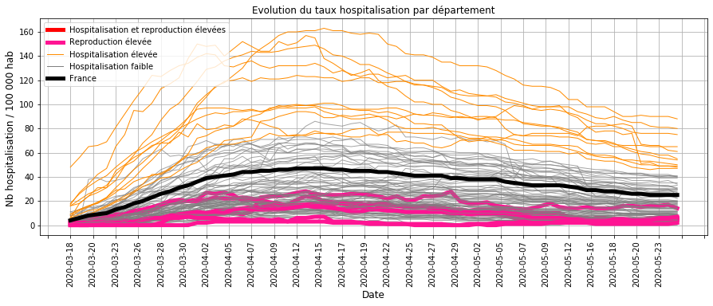
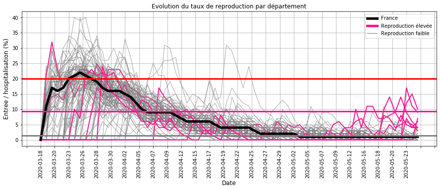
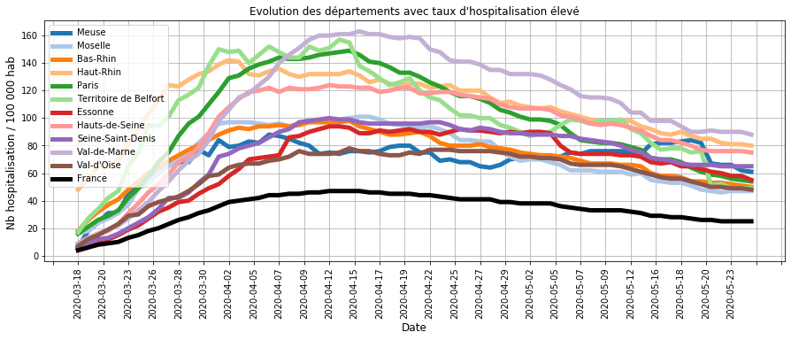
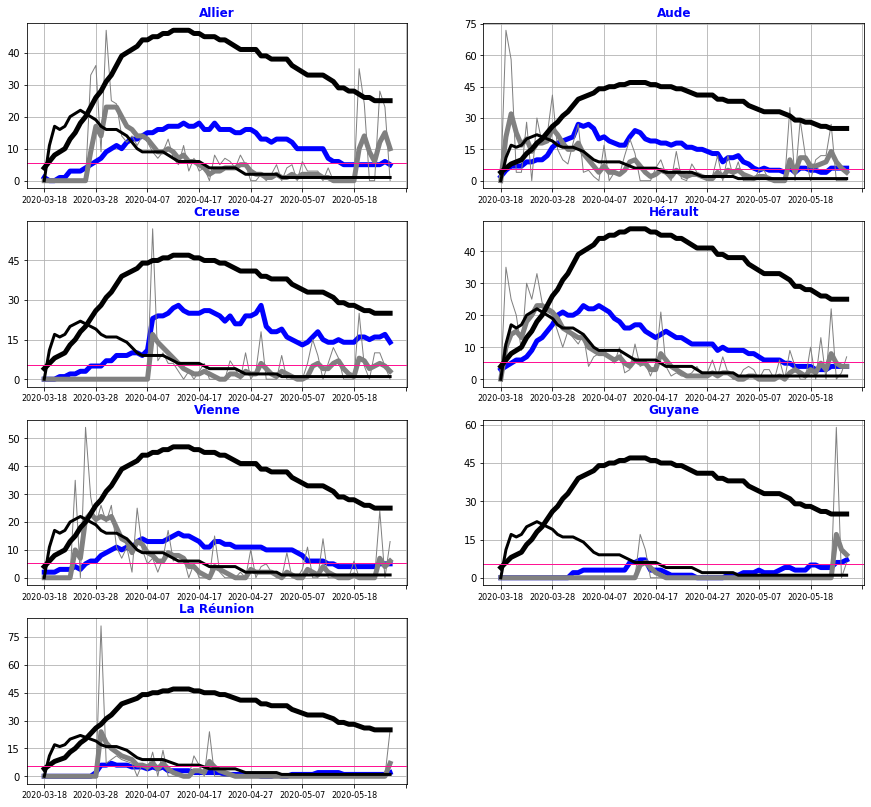

# Surveillance du COVID_19 pendant le deconfinement en France

## Origine des données
- nb hospitalisation, retour à domicile et décès quotidien sur le COVID19 sur le site data.gouv.fr
- nb habitant par département

## Traitement des données

### Calcul des indicateurs par département
- entrées en hospitalisation
- sorties en hospitalisation : guérison et décès
- taux d'hospitalisation : rapport du nombre d'hospitalisation pour 100 000 habitant (Thosp)
- taux de reproduction : rapport du nombre d'entrées pour 100 hospitalisations (Treprod)
- taux de reproduction lissé : filtre du 1er ordre avec une constante de temps de 3 jours (Treprodmoy)

### Classification des départements
- selon le taux d'hospitalisation en fin de période (CThosp)
- selon le taux de reproduction à chaque date (CTreprod)

### Création d'une alerte
- en cas d'un taux de reproduction moyen ou élevé
- et sur les 4 derniers jours de la période

## Surveillance de la tendance par département au 25 mai 2020
### Evolution des taux d'hospitalisation

#### Commentaires :
- la majorité des départements (GRIS) sont proches ou en dessous de la moyenne nationale (NOIR),
- tous les départements dont le taux d'hospitaliation est élevé (ORANGE) ont une tendance à la baisse,
- les départements dont le taux de reproduction est elevé (ROSE) ont un taux d'hospitalisation faible.

Il n'apparait donc pas de département en forte croissance où les taux d'hospitalisation et de reproduction seraient élevés.

### Evolution des taux de reproduction

#### Commentaires :
- de mi-avril à mi-mai, le taux de reproduction était faible du à l'impact du confinement
- à partir du déconfinement, il y a quelques départements (ROSE) dont le taux de reproduction est reparti à la hausse (la limite correspond à 10 entrées quotidiennes pour 100 hospitalisations).

Ces derniers nécessitent une analyse plus détaillée.

### Evolution des taux d'hospitalisation élevés

#### Commentaires : 
- La tendance des départements dont le taux d'hospitalisation est élevée est fortement à la baisse depuis quelques semaines
- Seule la Meuse (BLEU FONCE) dont la baisse est plus récente nécessite une surveillance dans les prochains jours.

### Evolution des taux de reproduction élevés

#### Commentaires :
L'analyse des départements dont le taux de reproduction a augmenté ces derniers jours montre que :
- L'Aude et de la Creuse ont une tendance stable depuis 3 semaines,
- la Guyane a une tendance à la hausse,
- pour les 4 autres départements, il faut surveiller dans les prochains jours, si la tendance se confirme.

## Bilan sur la circulation du virus au 25 mai 2020 :
La majorité des départements ont une chute du nombre d'hospitalisation, ce qui traduit une faible circulation du virus.

Quelques exceptions :
- l'Aude et la Creuse dont le taux d'hospitalisation  stable depuis 3 semaines indique que la maîtrise de la circulation du virus est insuffisante,
- la Guyane dont la hausse constante des hospitalisations depuis 3 semaines indique une accélération de la circulation du virus.

Une surveillance de la tendance sur les prochains jours est nécessaire pour :
- La Meuse dont le taux d'hospitalisation est élevée et dont la chute est très récente,
- l'Allier, l'Hérault, la Vienne et la Réunion dont le taux d'hospitalisation est faible mais dont le taux de reprodution a récemment augmenté,

## Sauvegarde

    [NbConvertApp] Converting notebook Surveillance_deconfinement.ipynb to html
    [NbConvertApp] Writing 1615012 bytes to Surveillance_deconfinement.html
    
