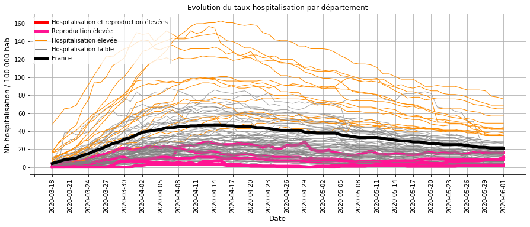
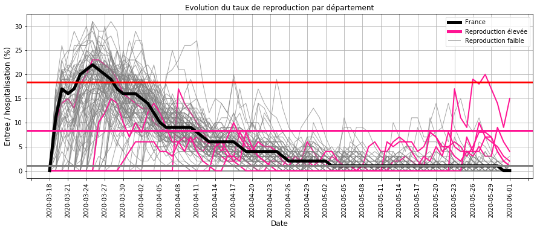
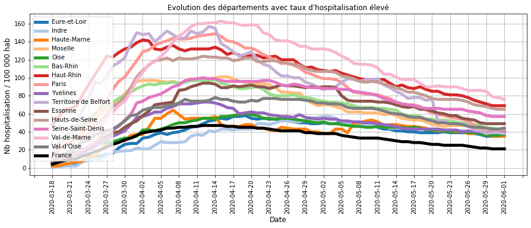
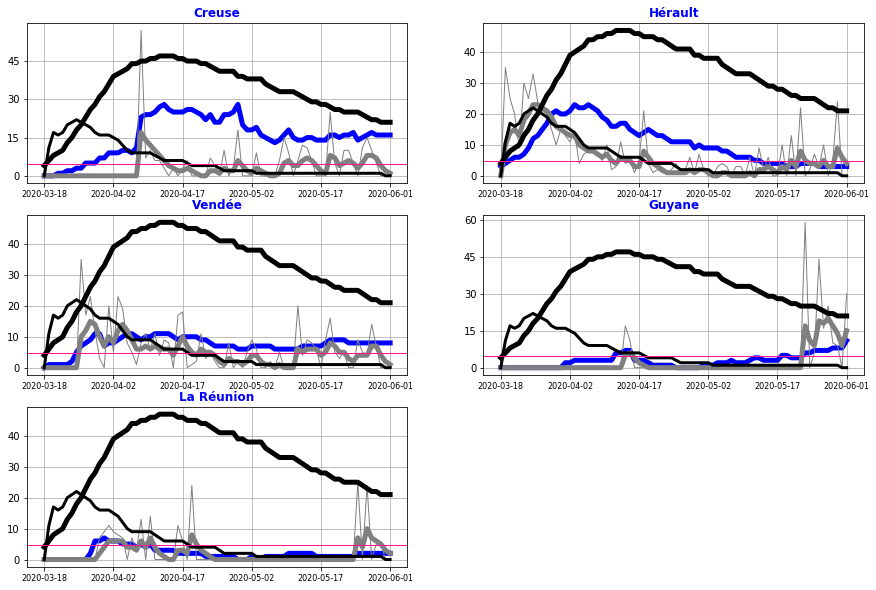

# Surveillance du COVID_19 pendant le deconfinement en France

## Origine des données
- nb hospitalisation, retour à domicile et décès quotidien sur le COVID19 sur le site data.gouv.fr
- nb habitant par département

## Traitement des données

### Calcul des indicateurs par département
- entrées en hospitalisation
- sorties en hospitalisation : guérison et décès
- taux d'hospitalisation : rapport du nombre d'hospitalisation pour 100 000 habitant (Thosp)
- taux de reproduction : rapport du nombre d'entrées pour 100 hospitalisations (Treprod)
- taux de reproduction lissé : filtre du 1er ordre avec une constante de temps de 3 jours (Treprodmoy)

### Classification des départements
- selon le taux d'hospitalisation en fin de période (CThosp)
- selon le taux de reproduction à chaque date (CTreprod)

### Création d'une alerte
- en cas d'un taux de reproduction moyen ou élevé
- et sur les 4 derniers jours de la période

## Surveillance de la tendance par département au 1er juin 2020
### Evolution des taux d'hospitalisation

#### Commentaires :
- la majorité des départements (GRIS) sont proches ou en dessous de la moyenne nationale (NOIR),
- tous les départements dont le taux d'hospitaliation est élevé (ORANGE) ont une tendance à la baisse,
- les départements dont le taux de reproduction est elevé (ROSE) ont un taux d'hospitalisation en dessous de la moyenne.

Il n'apparait donc pas de département en forte croissance où les taux d'hospitalisation et de reproduction seraient élevés.

### Evolution des taux de reproduction

#### Commentaires :
- de mi-avril à mi-mai, le taux de reproduction était faible du à l'impact du confinement
- à partir du déconfinement, il y a quelques départements (ROSE) dont le taux de reproduction est reparti à la hausse (la limite correspond à 10 entrées quotidiennes pour 100 hospitalisations).

Ces derniers nécessitent une analyse plus détaillée.

### Evolution des taux d'hospitalisation élevés

#### Commentaires : 
Les départements dont le taux d'hospitalisation sont élevés sont à la baisse depuis plusieurs semaines

### Evolution des taux de reproduction élevés

#### Commentaires :
L'analyse des départements dont la vitesse de reproduction a augmenté ces derniers jours montre que :
- la Creuse et la Vendée ont une tendance stable depuis plus d'1 mois,
- la Guyane a une tendance à la hausse.

Pour l'Hérault et la Réunion dont le taux d'hospitalisation est très faible, il faut surveiller dans les prochains jours, si la tendance se confirme.

## Bilan sur la circulation du virus au 1er juin 2020 :
La majorité des départements ont une chute du nombre d'hospitalisation, ce qui traduit une faible circulation du virus.

Quelques exceptions :
- la Creuse et la Vendée dont le taux d'hospitalisation  stable depuis 1 mois indique que la maîtrise de la circulation du virus est insuffisante,
- la Guyane dont la hausse constante des hospitalisations depuis 1 mois indique une accélération de la circulation du virus.

Une surveillance de la tendance est nécessaire pour l'Hérault et la Réunion dont le taux d'hospitalisation est très faible mais dont le taux de reprodution a récemment augmenté.

## Sauvegarde

    [NbConvertApp] Converting notebook Surveillance_deconfinement_2020_06_02.ipynb to html
    [NbConvertApp] Writing 1600647 bytes to Surveillance_deconfinement_2020_06_02.html
    

## Annexe

    interactive(children=(Dropdown(description='departement', index=63, options=('Ain', 'Aisne', 'Allier', 'Alpes-…

    <function __main__.Synthese_departement(departement)>

    interactive(children=(Dropdown(description='dep', index=100, options=('Ain', 'Aisne', 'Allier', 'Alpes-de-Haut…

    <function __main__.R0_departement(dep)>

