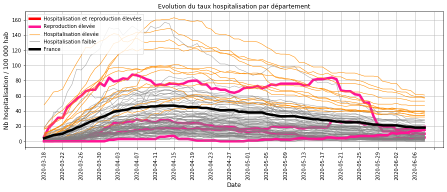

# Surveillance du COVID_19 pendant le deconfinement en France

## Origine des données
- nb hospitalisation, retour à domicile et décès quotidien sur le COVID19 sur le site data.gouv.fr
- nb habitant par département

## Traitement des données

### Calcul des indicateurs par département
- entrées en hospitalisation
- sorties en hospitalisation : guérison et décès
- taux d'hospitalisation : rapport du nombre d'hospitalisation pour 100 000 habitant (Thosp)
- taux de reproduction : rapport du nombre d'entrées pour 100 hospitalisations (Treprod)
- taux de reproduction lissé : filtre du 1er ordre avec une constante de temps de 3 jours (Treprodmoy)

### Classification des départements
- selon le taux d'hospitalisation en fin de période (CThosp)
- selon le taux de reproduction à chaque date (CTreprod)

### Création d'une alerte
- en cas d'un taux de reproduction moyen ou élevé
- et sur les 4 derniers jours de la période

## Surveillance de la tendance par département au  8 juin 2020
### Evolution des taux d'hospitalisation

#### Commentaires :
- la majorité des départements (GRIS) sont proches ou en dessous de la moyenne nationale (NOIR),
- tous les départements dont le taux d'hospitaliation est élevé (ORANGE) ont une tendance à la baisse,
- les départements dont le taux de reproduction est elevé (ROSE) ont un taux d'hospitalisation en dessous de la moyenne.

Il n'apparait donc pas de département en forte croissance où les taux d'hospitalisation et de reproduction seraient élevés.

### Evolution des taux de reproduction

#### Commentaires :
- de mi-avril à mi-mai, le taux de reproduction était faible du à l'impact du confinement
- à partir du déconfinement, il y a quelques départements (ROSE) dont le taux de reproduction est au-dessus des autres départements sur les derniers jours.

Ces derniers seront détaillés par la suite.

### Evolution des taux d'hospitalisation élevés

#### Commentaires : 
Les départements dont le taux d'hospitalisation sont élevés sont à la baisse depuis plusieurs semaines

### Evolution des taux de reproduction élevés

- le taux d'hospitalisation est représenté en BLEU pour le département et  la moyenne nationale en NOIR EPAIS,
- le taux ou vitesse de reproduction est représenté en GRIS EPAIS pour le département et en NOIR FIN pour la moyenne nationale
- le seuil en ROSE correpond à limite où le taux de reproduction du département est au dessus de la majorité des autres départements.

#### Commentaires :
L'analyse des départements dont la vitesse de reproduction (GRIS) a augmenté ces derniers jours montre que :
- la Meuse a une augmentation du taux de reproduction depuis 1 semaine,
- la Guyane a une tendance à la hausse avec un taux d'hospitalisation (BLEU) qui augmente.

L'Allier et les Ardennes ont eu une hausse du taux de reproduction (GRIS) sur les derniers jours mais avec un taux d'hospitalisation qui reste faible et à la baisse (BLEU).

## Bilan sur la circulation du virus au 8 juin 2020 :
La majorité des départements ont une chute du nombre d'hospitalisation, ce qui traduit une faible circulation du virus.

Quelques exceptions :
- La Meuse dont la hausse du taux de reproduction depuis 1 semaine indique que la maîtrise de la circulation du virus est insuffisante,
- la Guyane dont la hausse constante des hospitalisations depuis 1 mois indique une accélération de la circulation du virus.

Une surveillance de la tendance est nécessaire pour L'Allier et les Ardennes dont le taux d'hospitalisation est  faible ou à la baisse mais dont le taux de reprodution a récemment augmenté.

## Sauvegarde
