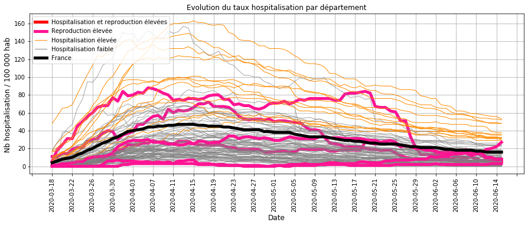
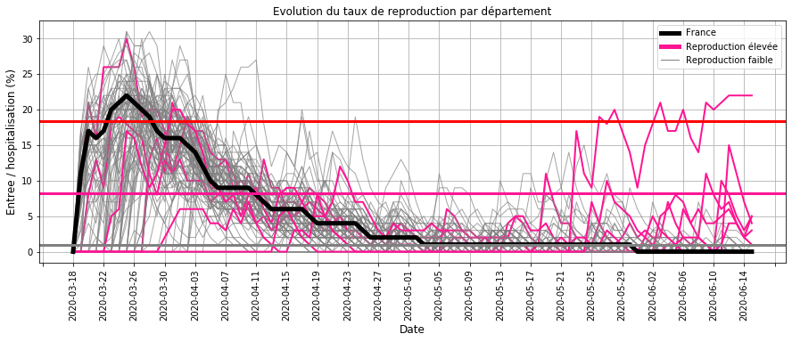
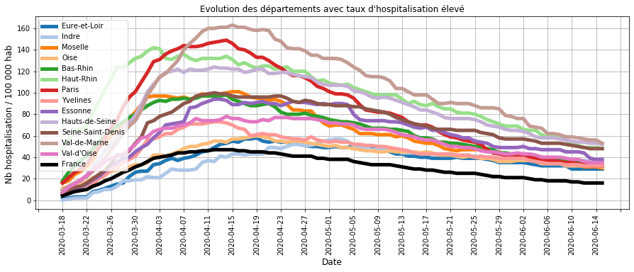
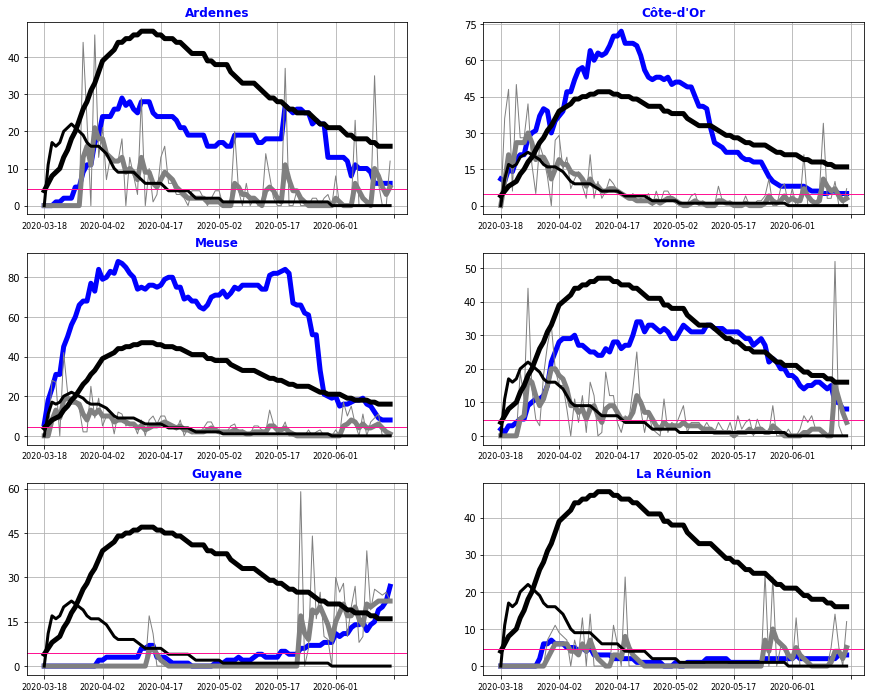

# Surveillance du COVID_19 pendant le deconfinement en France

## Origine des données
- nb hospitalisation, retour à domicile et décès quotidien sur le COVID19 sur le site data.gouv.fr
- nb habitant par département

## Traitement des données

### Calcul des indicateurs par département
- entrées en hospitalisation
- sorties en hospitalisation : guérison et décès
- taux d'hospitalisation : rapport du nombre d'hospitalisation pour 100 000 habitant (Thosp)
- taux de reproduction : rapport du nombre d'entrées pour 100 hospitalisations (Treprod)
- taux de reproduction lissé : filtre du 1er ordre avec une constante de temps de 3 jours (Treprodmoy)

### Classification des départements
- selon le taux d'hospitalisation en fin de période (CThosp)
- selon le taux de reproduction à chaque date (CTreprod)

### Création d'une alerte
- en cas d'un taux de reproduction moyen ou élevé
- et sur les 4 derniers jours de la période

## Surveillance de la tendance par département au  8 juin 2020
### Evolution des taux d'hospitalisation

#### Commentaires :
- la majorité des départements (GRIS) sont proches ou en dessous de la moyenne nationale (NOIR),
- tous les départements dont le taux d'hospitaliation est élevé (ORANGE) ont une tendance à la baisse,
- les départements dont le taux de reproduction est elevé (ROSE) ont un taux d'hospitalisation en dessous de la moyenne à l'exception de Guyane (cf. analyse ci-dessous).

### Evolution des taux de reproduction

#### Commentaires :
- de mi-avril à mi-mai, le taux de reproduction était faible du à l'impact du confinement
- à partir du déconfinement, certains départements (ROSE) ont un taux de reproduction au-dessus des autres départements sur quelques jours à l'exception de la Guyane où la tendance persiste.

Ces derniers seront détaillés par la suite.

### Evolution des taux d'hospitalisation élevés

#### Commentaires : 
Les départements dont le taux d'hospitalisation sont les plus élevés sont à la baisse depuis plusieurs semaines

### Evolution des taux de reproduction élevés
- le taux d'hospitalisation est représenté en BLEU pour le département et en NOIR EPAIS pour la France entière,
- la vitesse de reproduction est représentée en GRIS EPAIS pour le département et en NOIR FIN pour la France entière,
- le seuil en ROSE correpond à limite où le taux de reproduction du département est au dessus de la majorité des autres départements.

#### Commentaires :
L'analyse des départements dont la vitesse de reproduction (GRIS) a augmenté ces derniers jours montre que :
- à l'exception de la Guyane, les départements avec une augmentation du taux de reproduction sur la dernière semaine ont  un taux d'hospitalisation faible (10 / 100 000 habitants),
- par contre, la Guyane a une tendance à la hausse avec un taux d'hospitalisation (BLEU) qui augmente fortement.

## Bilan sur la circulation du virus au 15 juin 2020 :
La majorité des départements ont une chute du nombre d'hospitalisation, ce qui traduit une faible circulation du virus.

Quelques exceptions :
- la hausse du taux de reproduction depuis 1 semaine pour Les Ardennes, la Côte-d'or, La Meuse, l'Yonne et la Réunion indique que la maîtrise de la circulation du virus y est insuffisante et nécessite une surveillance renforcée,
- la Guyane avec une hausse constante des hospitalisations depuis 1 mois indique une accélération de la circulation du virus et nécessite des mesures adaptées.

## Sauvegarde
