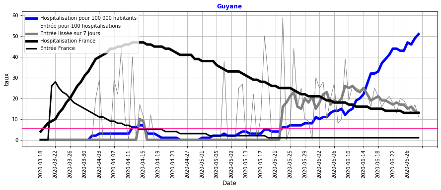

# Surveillance du COVID_19 pendant le deconfinement en France

## Origine des données
- nb hospitalisation, retour à domicile et décès quotidien sur le COVID19 sur le site data.gouv.fr
- nb habitant par département

## Traitement des données

### Calcul des indicateurs par département
- entrées en hospitalisation
- sorties en hospitalisation : guérison et décès
- taux d'hospitalisation : rapport du nombre d'hospitalisation pour 100 000 habitant (Thosp)
- taux de reproduction : rapport du nombre d'entrées pour 100 hospitalisations (Treprod)
- taux de reproduction lissé : filtre du 1er ordre avec une constante de temps de 3 jours (Treprodmoy)

     lissage entree : France                                               

### Classification des départements
- selon le taux d'hospitalisation en fin de période (CThosp)
- selon le taux de reproduction à chaque date (CTreprod)

    Classement Thosp :  [[  6.26609206]
     [ 22.42942416]
     [ 44.76563623]
     [ 77.17582418]
     [129.24571429]]
    

### Création d'une alerte
- en cas d'un taux de reproduction  élevé 
- dans la dernière semaine

     calcul alarme : France                                               

## Surveillance de la tendance récente par département
### Evolution des taux d'hospitalisation

#### Commentaires :
- la majorité des départements (GRIS) sont proches ou en dessous de la moyenne nationale (NOIR),
- les autres départements dont le taux d'hospitaliation est moyen (ORANGE) ont une tendance à la baisse,
- le département de la Guyane dont le taux de reproduction est elevé (ROSE) a un taux d'hospitalisation qui devient élevé.

### Evolution des taux de reproduction

#### Commentaires :
- de mi-avril à mi-mai, le taux de reproduction est faible du à l'impact du confinement
- à partir du déconfinement, quelques départements ont ponctulellement un taux de reproduction au-dessus des autres départements (Limite ROSE)
- à l'exception de la Guyane (ROSE) où un taux de reprodution élevé persiste depuis 1 mois.

### Evolution des taux d'hospitalisation les plus élevés

#### Commentaires : 
Les départements dont les taux d'hospitalisation sont le plus élevés sont à la baisse depuis plusieurs semaines et les valeurs très éloignées de celles atteintes au plus fort de l'épidémie (début Avril).

Seule la Guyane a un taux d'hospitalisation qui augmente fortement avec le taux d'hospitalisation le plus élevé.

### Evolution des taux de reproduction élevés
- le taux d'hospitalisation est représenté en BLEU pour le département et en NOIR EPAIS pour la France entière,
- la vitesse de reproduction est représentée en GRIS EPAIS pour le département et en NOIR FIN pour la France entière,
- le seuil en ROSE correpond à limite où le taux de reproduction du département est au dessus de la majorité des autres départements.

#### Commentaires :
La Guyane a un taux de reproduction (GRIS FONCE) elevé depuis fin mai.

Cette augmentation depuis 1 mois se traduit par une très forte augmentation du taux d'hospitalisation (BLEU) qui dépasse la valeur du pic épidémique moyen en métropole de mi Avril.

La baisse du taux de reproduction depuis mi-juin (25 à 15 %) indique que des mesures plus strictes commencent à ralentir la vitesse de circulation du virus. Mais elles sont encores insuffisantes.

## Bilan sur la circulation du virus au 29 juin 2020 :
La majorité des départements ont une chute du nombre d'hospitalisation, ce qui traduit une faible circulation du virus.

Depuis le déconfinement, certains départements ont eu ponctuellement des taux de reproduction à la hausse. Le maintien d'un système de surveillance est donc nécessaire pour s'assurer que ces derniers ne persistent pas.

Seule la Guyane avec une hausse constante des hospitalisations depuis 1 mois a subi une accélération de la circulation du virus. Des mesures récentes plus strictes commencent à montrer leur effet sur la diminution du taux de reproduction mais celui-ci n'a pas encore atteint la limite qui permet une décroissance du nombre d'hospitalisation.

## Sauvegarde
