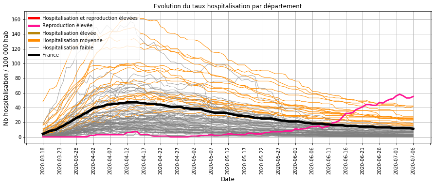
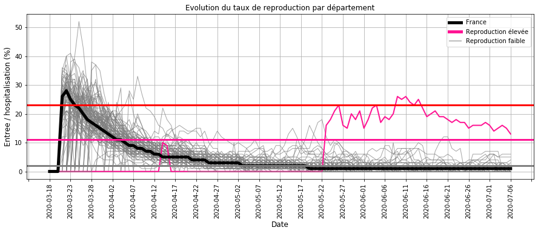
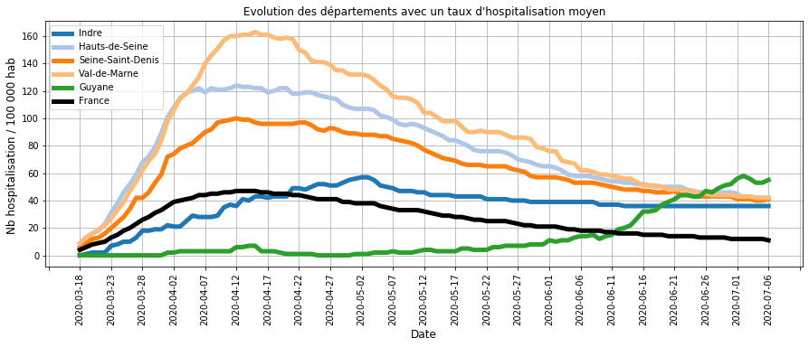
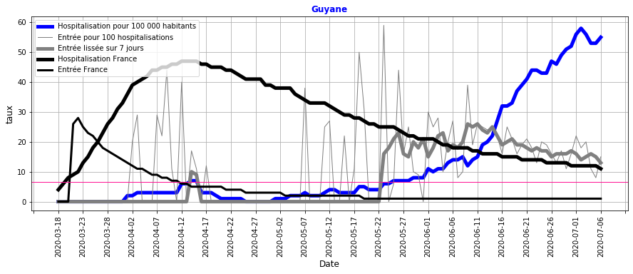
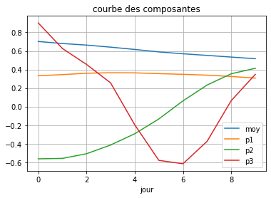
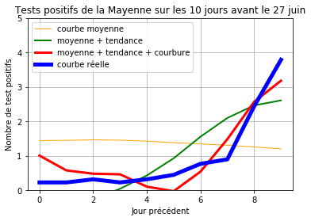
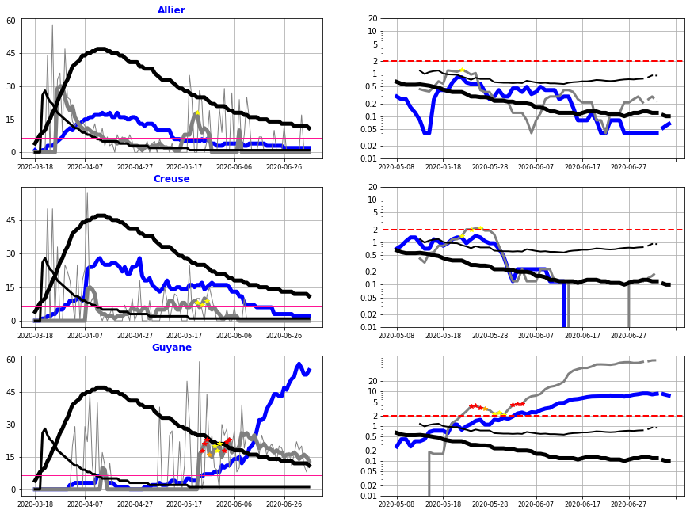
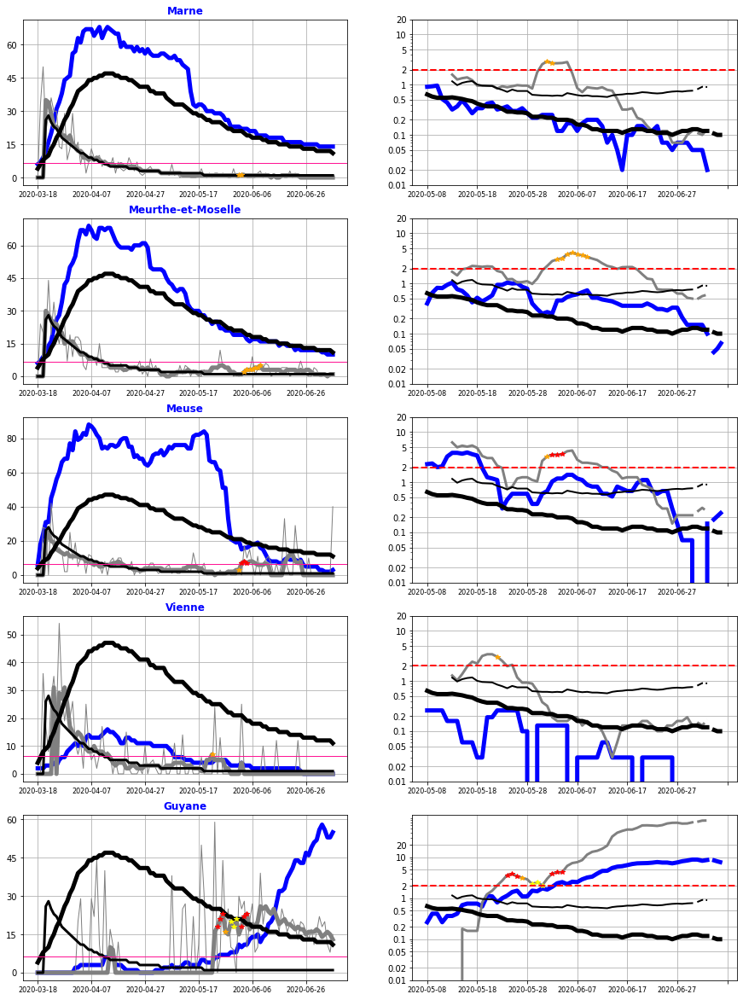
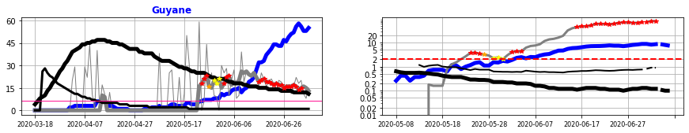
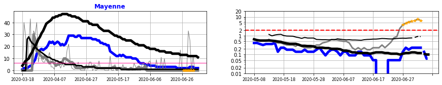

    
    

# Surveillance du COVID_19 pendant le déconfinement en France

## I. Récupération des données
- nombre d'hospitalisation, retour à domicile et décès quotidien et par département sur le COVID-19 sur le site data.gouv.fr
- nombre de test virologique quotidien par département sur le COVID-19 sur le site data.gouv.fr
- nombre d'habitant par département

## II. Traitement des données

### Calcul des indicateurs par département
- entrées en hospitalisation
- sorties en hospitalisation : nombre de guérison et de décès
- taux d'hospitalisation (Thosp) : nombre d'hospitalisation pour 100 000 habitant
- taux de reproduction (Treprod) : nombre d'entrée pour 100 hospitalisations
- taux de reproduction lissé (Treprodmoy) : moyenne sur 3 jours

                                                                           
    

### Classification quotidien des départements
- selon le taux d'hospitalisation  (CThosp)
- selon le taux de reproduction (CTreprod)

    Limite des zones du taux d'hospitalisation (/ 100 000 habitants) :
    très bas <  14  < bas <  34  < moyen <  62  < élevé <  104  < très élevé
    
    Limite des zones du taux de reproduction quotidien des entrées (/ 100 hospitalisations) :
    bas <  6  < élevé <  16  < très élevé 
    

### Création d'une alerte sur les entrées hospitalières
- en cas d'un taux de reproduction élevé des entrées  
- dans la dernière semaine

                                                                                         

## III. Surveillance des tendances hospitalières
### Evolution du taux d'hospitalisation

#### Commentaires :
- la majorité des départements (GRIS) sont proches ou en dessous de la moyenne nationale (NOIR),
- les autres départements dont le taux d'hospitaliation est moyen (ORANGE) ont une tendance à la baisse,
- le département de la Guyane dont le taux de reproduction est elevé (ROSE) a un taux d'hospitalisation qui devient élevé.

### Evolution du taux de reproduction des entrées hospitalières

#### Commentaires :
- de mi-avril à mi-mai, le taux de reproduction est faible du à l'impact du confinement
- à partir du déconfinement, quelques départements ont ponctulellement un taux de reproduction au-dessus des autres départements (Limite ROSE)
- Seule la Guyane (ROSE) à un taux de reprodution élevé qui persiste depuis fin mai.

### Evolution des départements avec les  taux d'hospitalisation les plus élevés

#### Commentaires : 
Les départements dont les taux d'hospitalisation sont le plus élevés sont à la baisse depuis plusieurs semaines et les valeurs sont très éloignées de celles atteintes au plus fort de l'épidémie (début Avril).

Seule la Guyane a un taux d'hospitalisation qui augmente.

### Evolution des départements avec des taux de reproduction élevés
- le taux d'hospitalisation est représenté en BLEU pour le département et en NOIR EPAIS pour la France entière,
- le taux de reproduction des entrées est représenté en GRIS EPAIS pour le département et en NOIR FIN pour la France,
- un taux de reproduction au dessus du seuil en ROSE correspond à une évolution croissante.

#### Commentaires :
**La Guyane** a un taux de reproduction (GRIS FONCE) elevé depuis fin mai.

Cette augmentation se traduit par une forte augmentation du taux d'hospitalisation (BLEU) qui dépasse la valeur du pic épidémique moyen en métropole de mi-avril.

La baisse du taux de reproduction depuis mi-juin (25 à 15 %) indique que des mesures plus strictes commencent à ralentir la vitesse de circulation du virus. Mais elles sont encore insuffisantes.

## IV. Analyse de la tendance à partir des tests de dépistage.

Depuis le déconfinement, un suivi par département des résultats quotidiens des tests virologiques a été mis en place : les données sont à disposition sur le site data.gouv.fr.

**L'objectif de cette étude** est d'établir une relation entre les entrées à l'hôpital et les tests virologiques positifs. Par la suite, cette relation permettra de :
- d'anticiper les entrées à l'hôpital.
- et de vérifier que les entrées à l'hôpital sont accompagnées de tests de dépistage pour isoler la chaine de transmission.

### Construction de la régression logistique PLS

**La période** choisie pour établir la relation entre les entrées hospitalières et les tests de dépistage a été la phase 1 et 2 du déconfinement où 
- les moyens sont en place pour une utilisation massive des tests de dépistage,
- et la circulation du virus y était encore élevée dans certains départements.

**Les observations à expliquer** sont la présence ou non (1/0) d'une alerte sur les entrées à l'hôpital, calculée quotidiennement par  département :
- le taux d'hospitalisation est le nombre d'hopitalisation pour 100 000 habitants,
- le taux de reproduction des entrées à l'hôpital (Treprod) est le nombre d'entrées pour 100 hospitalisations,
- ce taux de reproduction a été moyenné sur 3 jours (Treprodmoy),
- l'analyse des hospitalisations jusqu'au 15 juin a permis d'établir les seuils de l'alerte sur les entrées:
    - soit le taux de reproduction dépasse les 16 %,
    - soit le taux d'hospitalisation dépasse les 15 cas pour 100 000 habitant et le taux de reproduction dépasse les 6 %.

**Les variables explicatives** sont les tests virologiques positifs sur les 10 derniers jours précédent le calcul d'une alerte sur les entrées hospitalières.        

    
    

    
    

    
    

    
    

### Résultats de la régression logistique PLS

**La regression logistique PLS** a permis de traduire l'évolution des tests positifs sur les 10 derniers jours par l'addition de 3 composantes (cf. graphe ci-dessous) :
- la première composante quasiment constante (ORANGE) traduit l'évolution par rapport à la moyenne (BLEU),
- la deuxième compostante (VERTE) traduit une tendance à la hausse ou à la baisse,
- la troisième composante (ROUGE) traduit une courbure plus ou moins exponentielle de la tendance.

    <matplotlib.legend.Legend at 0xeeff570>

**L'exemple** ci-dessous de la Mayenne au 27 juin illustre cette décomposition :
- la courbe BLEUE est l'évolution réelle des tests positifs,
- en ORANGE : la tendance moyenne,
- en VERT : ajout de l'évolution à la hausse,
- en ROUGE : ajout de la courbure (exponentielle) de la tendance pour représenter l'évolution prise en compte par le modèle.

Cela traduit que l'évolution des tests positifs de la Mayenne au 27 juin suit une croissance exponentielle.

    
    

Le tableau suivant présente **les coefficients de la régression** x1, x2 et x3 pour chacune des composantes qui ont un poids équivalent.

Les résultats aux tests statistiques de significativité du modèle globale et des différents coefficients montrent que  les alertes sur les entrées hospitalières sont en relation avec les tests de dépistage positifs des 10 derniers jours.

                               Logit Regression Results                           
    ==============================================================================
    Dep. Variable:                      y   No. Observations:                 2411
    Model:                          Logit   Df Residuals:                     2407
    Method:                           MLE   Df Model:                            3
    Date:                Tue, 07 Jul 2020   Pseudo R-squ.:                  0.5435
    Time:                        07:58:44   Log-Likelihood:                -43.914
    converged:                       True   LL-Null:                       -96.190
    Covariance Type:            nonrobust   LLR p-value:                 1.632e-22
    ==============================================================================
                     coef    std err          z      P>|z|      [0.025      0.975]
    ------------------------------------------------------------------------------
    const         -6.9641      0.630    -11.057      0.000      -8.199      -5.730
    x1             0.6558      0.132      4.970      0.000       0.397       0.914
    x2             1.0014      0.224      4.481      0.000       0.563       1.440
    x3             1.2702      0.545      2.331      0.020       0.202       2.338
    ==============================================================================
    

### Précision du modèle
Les résultats suivant entre les alertes réelles et celles vues par le modèle sont détaillés par la suite :

    Nombre d'alerte détectée par le modèle      : 9
    
    Nombre d'alerte non détectée par le modèle  : 7
    
    Absence d'alerte détectée par le modèle     : 2383
    
    Absence d'alerte vu en alerte par le modèle : 12
    

**Les alertes non détectées**   par le modèle (point JAUNE sur les graphiques ci-dessous) s'expliquent :
- l'Allier et la Creuse : le nombre de tests positifs faibles (GRIS sur le graphique de droite) par rapport aux entrées à l'hôpital (BLEUE sur le graphique de droite) traduit que les tests ont été insuffisants (seuls les cas à l'hôpital ont été testés !!!),
- la Guyane : le nombre de tests encore faible et en rechute (qui sera suivi par d'une croissance des tests positifs détectés par le modèle (point ROUGE)) traduit une tendance début juin encore incertaine.

**Les alertes détectées en trop**   par le modèle (point ORANGE sur les graphiques ci-dessous) s'expliquent :
- La Marne et  la Meurthe-et-Moselle ont une hausse des tests début juin (> 2 cas pour 100 000 habitants pendant 1 semaine) alors que les taux d'hospitalisation sont encore élevés : pour des départements encore sous tension, une telle alerte est donc pertinente,
- la Meuse et la Guyane : les alertes anticipent la hausse du taux de reproduction des entrées à l'hôpital (points ROUGES).
- la Vienne : l'alerte sur les tests positifs est en relation avec un taux de reproduction des entrées qui augmente (c'est un taux d'hospitalisation faible qui explique l'absence d'alerte sur les entrées hospitalières).

#### Bilan sur la précision du modèle
- les alertes sur la hausse du taux de reproduction des entrées hospitalières sont en lien avec les tests virologiques positifs sur les 10 derniers jours,
- lorsque le modèle n'explique par ces alertes, les tests de depistage ont été insuffisants,
- lorsque le modèle propose des alertes sur les tests positifs sans une hausse des entrées hospitalières, celles-ci ont lieu alors que la tension hospitalière est encore élevée ou que l'évolution sera par la suite à la hausse : elles restent donc pertinentes.

Etant donné la pertience des résultats, il a été décidé de retenir ce modèle comme un moyen supplémentaire de surveiller l'évolution de la circulation du virus en France.

## V. Surveillance de l'évolution des tests positifs de dépistage

    Début de la période de surveillance :  2020-06-15
    

#### Alertes sur les  entrées hospitalières accompagnées de test de depistage
**Seule la Guyane** a eu des alertes (point ROUGE) sur le taux de reproduction (GRIS à gauche) accompagnées par un nombre de test important (Gris à droite). Le nombre de test positif est encore trop élevé pour envisager une baisse significative des entrées à l'hospital dans les jours qui suivent.

#### Alertes sur les entrées hospitalières non accompagnées de tests de depistage
L'absence d'alerte ne permet pas de mettre en évidence un éventuel relachement du système de dépistage. 

    <Figure size 1080x360 with 0 Axes>

#### Alertes sur les tests de depistage non suivies d'une hausse significatives des entrées hospitalières
**La mayenne** a eu une hausse récente des tests positifs (ORANGE à droite) suivie d'une remontée des entrées hospitalières (BLEU à droite) : une vigilence est nécessaire sur l'évolution future de ce département.

## VI. Bilan sur la circulation du virus au 6 juillet 2020 :
La majorité des départements ont une chute du nombre d'hospitalisation, ce qui traduit globalement une faible circulation du virus.

Depuis le déconfinement, certains départements ont ponctuellement un taux de reproduction à la hausse. Le maintien d'un système de surveillance est donc nécessaire pour s'assurer que ces derniers ne persistent pas : l'exemple de la Creuse ou de l'Allier où la hausse des entrées à l'hôpital fin mai ne s'est pas traduit par une hausse des tests virologiques montre qu'il est nécessaire de renforcer la mise en oeuvre de ce système de dépistage.

**La Guyane** avec une hausse constante des hospitalisations depuis 6 semaines a subi une accélération de la circulation du virus. Des mesures récentes plus strictes commencent à montrer leur effet sur la diminution du taux de reproduction mais celui-ci n'a pas encore atteint la limite qui permet une décroissance du nombre d'hospitalisation et les tests de dépistages positifs sont encore très élevés.

**La Mayenne** qui a récemment eu un nombre élevé de tests positifs nécessite une surveillance plus soutenue.

    Merci pour votre attention.
    

    interactive(children=(Dropdown(description='departement', index=63, options=('Ain', 'Aisne', 'Allier', 'Alpes-…

    <function __main__.Synthese_departement(departement)>

    interactive(children=(Dropdown(description='departement', index=53, options=('Ain', 'Aisne', 'Allier', 'Alpes-…

    <function __main__.Courbe_decomposition(departement, jour)>

