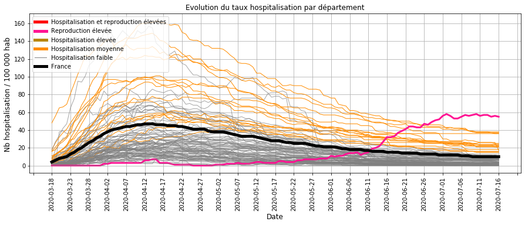
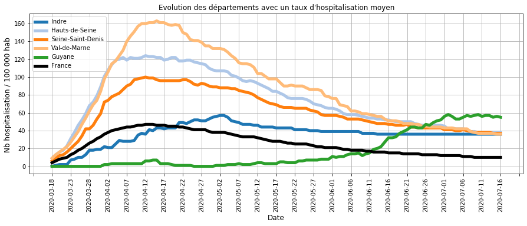
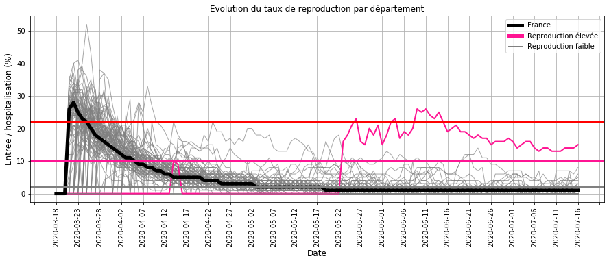
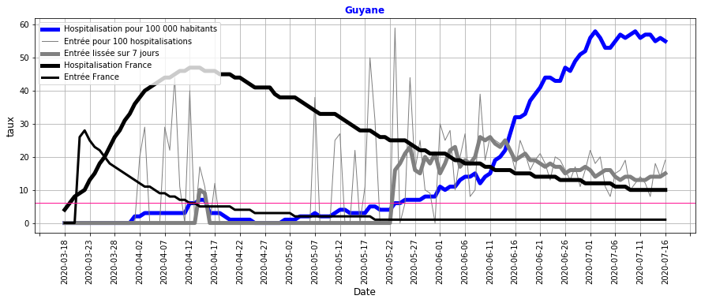
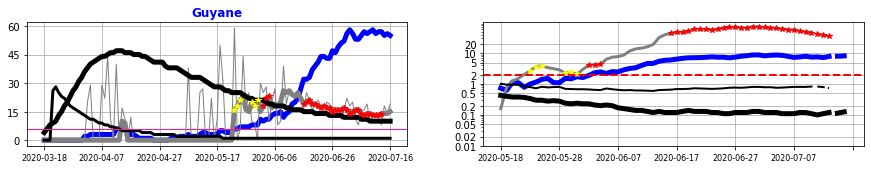
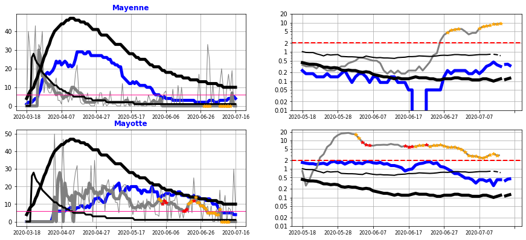

# Surveillance du COVID_19 en France

Bonjour,

L'objet de cette étude est de calculer les indicateurs et les modèles qui permettent de suivre et d'anticiper l'évolution de l'épidémie de Covid-19 en France :
- les 3 premières chapites présentent les données utilisées, les principes des calculs et les hypothèses retenues.
- les chapitre IV et V (bilan) décrivent l'évolution de l'épidémie et identifient les départements à particulièrement surveiller.

Toutes les semaines une mise à jour est réalisée à partir des nouvelles données hospitalières et de tests de dépistage.

## I. Origine des données
- nombre d'hospitalisation, retour à domicile et décès quotidien et par département sur le COVID-19 sur le site data.gouv.fr
- Nombre et résultat des tests de dépistage virologiques quotidiens par département sur le COVID-19 sur le site data.gouv.fr
- nombre d'habitant par département

## II. Construction des indicateurs

### Calcul des indicateurs par département
- entrées en hospitalisation
- sorties en hospitalisation : nombre de guérison et de décès
- taux d'hospitalisation (Thosp) : nombre d'hospitalisation pour 100 000 habitant
- taux d'entrées hospitalières (Treprod) : nombre d'entrée pour 100 hospitalisations
- taux d'entrées lissé (Treprodmoy) : moyenne sur 3 jours

                                                                           
    

### Classification quotidien des départements
- pour le taux d'hospitalisation  (CThosp), il s'agit de rassembler les valeurs observées en 5 grandes catégories (très bas, bas, moyen, élevé, très élevé) qui permettront de situer l'ampleur des hospitalisations dans un département,
- pour le taux des entrées hospitalières (CTreprod) : il s'agit de rassembler les valeurs observées en 3 grandes catégories (bas, élevé, très élevés) qui permettront de dire si la tendance d'un département est à la hausse à la baisse.

    Limite des zones du taux d'hospitalisation (/ 100 000 habitants) :
    très bas <  15  < bas <  35  < moyen <  62  < élevé <  103  < très élevé
    
    Limite des zones du taux de reproduction quotidien des entrées (/ 100 hospitalisations) :
    bas <  6  < élevé <  16  < très élevé 
    

### Création d'une alerte sur les entrées hospitalières
- en cas d'un taux élevé d'entrées hospitalières (qui traduit une tendance à la hausse),  
- dans la dernière semaine

                                                                                         

### III. Construction d'un modèle pour relier les entrées hospitalières aux tests de dépistage positifs.

### Modélisation à partir d'une régression logistique PLS

Depuis le déconfinement, un suivi par département des résultats quotidiens des tests virologiques a été mis en place.

**L'objet du modèle** est d'établir une relation entre les entrées à l'hôpital et les tests positifs. Cette relation permettra :
- d'anticiper les entrées à l'hôpital.
- de vérifier que les entrées à l'hôpital sont accompagnées de tests de dépistage pour isoler les chaines de contamnination.

**La période** choisie pour établir la relation entre les entrées hospitalières et les tests de dépistage a été la phase 1 et 2 du déconfinement où 
- les moyens sont en place pour une utilisation massive des tests de dépistage,
- la circulation du virus était encore élevée dans certains départements.

**Les données à expliquer** sont la présence ou non (1/0) d'une alerte sur les entrées à l'hôpital, calculée quotidiennement par  département.

**Les données explicatives** sont les tests positifs sur les 10 derniers jours précédent le calcul d'une alerte sur les entrées hospitalières. 

    
    

    
    

    
    

    
    

    
    

    
    

    
    

    
    

    
    

### Analyse de la précision du modèle
Les alertes réelles sur les entrées hospitalières et celles prédites par le modèle à partir des tests positifs  ont été comparées :

    Alertes détectées par le modèle    : 8
    
    Alertes non détectées              : 13
    
    Cas sans alerte                    : 2384
    
    Fausses alertes vues par le modèle  : 2
    

**Les alertes non détectées**   par le modèle  s'expliquent :
- pour l'Allier et la Creuse : les tests positifs ont été faibles par rapport aux entrées à l'hôpital, ce qui traduit un nombre de test de dépistage insuffisant et donc montre l'intérêt d'identifier ce type de département,
- pour la Guyane : le nombre de tests encore faible et en rechute (qui sera suivi par d'une croissance des tests positifs détectés ensuite par le modèle) traduit une tendance début juin encore incertaine.

**Les fausses alertes** détectées par le modèle  s'expliquent :
- La Marne et  la Meurthe-et-Moselle ont une hausse des tests positifs début juin (> 2 cas pour 100 000 habitants pendant 1 semaine) alors que les taux d'hospitalisation sont encore élevés : pour des départements encore sous tension, une telle alerte est donc pertinente,
- pour la Meuse et la Guyane : les alertes anticipent la hausse des entrées à l'hôpital,
- la Vienne : l'alerte sur les tests positifs est en relation avec des entrées qui augmentent (un taux d'hospitalisation faible explique l'absence d'alerte sur les entrées hospitalières).

### Bilan sur la précision du modèle
- les alertes sur la hausse des entrées hospitalières sont en lien avec les tests positifs sur les 10 derniers jours,
- lorsque le modèle n'explique par ces alertes, les tests de depistage ont été insuffisants,
- lorsque le modèle propose des alertes sur les tests positifs sans une hausse des entrées hospitalières, celles-ci ont lieu alors que la tension hospitalière est encore élevée ou que l'évolution sera par la suite à la hausse : elles restent donc pertinentes.

Etant donné la pertience des résultats, il a été décidé de retenir ce modèle comme un moyen supplémentaire de surveiller l'évolution de la circulation du virus en France à partir du 15 juin.

## IV. Surveillance des hospitalisations et des tests de dépistage

### Taux d'hospitalisation par département
#### Description :
Ce graphique montre l'évolution des hospitalisations par département depuis le début du confinement (18 mars).
- en NOIR       : la France
- en ORANGE FIN : départements dont le taux d'hospitalisation est à un niveau moyen
- en GRIS       : départements dont le taux d'hospitalisation est à un niveau bas
- en ROSE       : départements dont les entrées hospitalières sont élevées (ce qui traduit une croissance à la hausse)

#### Commentaires :
- la majorité des départements (GRIS) sont proches ou en dessous de la moyenne française (NOIR),
- les autres départements dont le taux d'hospitaliation est moyen (ORANGE) ont une tendance à la baisse,
- la Guyane (ROSE) dont les entrées hospitalières sont elevées a un taux d'hospitalisation élevé qui stagne.

###  Départements dont les taux d'hospitalisation sont actuellement les plus élevés
#### Description :
Ce graphique détaille l'évolution des départements dont les taux d'hospitalisations sont actuellement les plus élevés.

#### Commentaires : 
Les départements dont les taux d'hospitalisation sont les plus élevés sont à la baisse depuis plusieurs semaines et les valeurs éloignées de celles du pic de l'épidémie début Avril.

Seule la **Guyane** a un taux d'hospitalisation qui a récemment augmenté.

Le taux d'hospitalisation de **l' Indre** qui est fixe depuis 1 mois traduit surement l'absence de mise à jour des données. 

### Les entrées hospitalières
#### Description :
Le graphique montre l'évolution des entrées hospitalières (pour 100 hopitalisations) par département depuis le début du confinement (19 mars).
- En GRIS : les départements dont le taux de reproduction est actuellement faible ce qui traduit un ralentissement de la circulation du virus,
- EN NOIR : la France,
- En ROSE : les départements dont le taux de reproduction est actuellement élevé, ce qui traduit une accélération de la circulation du virus.

#### Commentaires :
- à partir du déconfinement (mai), quelques départements ont ponctuellement des entrées hospitalières au-dessus des autres départements (Limite ROSE),
- Seule **la Guyane (ROSE)** présente un taux de reprodution élevé depuis fin mai.

### Départements dont les entrées hospitalières sont élevées
#### Description :
Ces graphiques détaillent l'évolution des départements dont les entrées hospitalières sont élevées :
- le taux d'hospitalisation est représenté en BLEU pour le département et en NOIR EPAIS pour la France,
- le taux d'entrées hospitalières (sur 100 hospitalisations) est représenté en GRIS EPAIS pour le département et en NOIR FIN pour la France,
- un taux au dessus du seuil en ROSE correspond à une évolution croissante de l'épidémie.

#### Commentaires :
**La Guyane** a un taux de reproduction (GRIS FONCE) élevé depuis fin mai.

Cette augmentation se traduit par une forte augmentation du taux d'hospitalisation (BLEU) qui dépasse la valeur du pic épidémique moyen en métropole de mi-avril.

La baisse du taux de reproduction depuis mi-juin (25 à 15 %) indique que des mesures plus strictes commencent à ralentir la vitesse de circulation du virus. Mais elles sont encore insuffisantes pour permettre une décroissance de la circulation du virus.

### Résultats de tests de depistage pour les départements critiques
#### Description :
Ces graphiques concernent les départements dont le taux des entrées hospitalières est élevé, qui traduit une croissance de l'épidémie. Les tests de dépistages y sont donc nécessaires pour surveiller l'épidémie.

Le graphique de droite compare :
- l'évolution des entrées hospitalières du département (BLEU) et de France (NOIR EPAIS),
- l'évolution des tests positifs du département (GRIS) et de la France (NOIR FIN).

Il s'agit d'évaluer l'ampleur des contamninations à travers les résultats des tests de dépistage.

#### Commentaires :
**La Guyane** a eu une hausse des entrées hospitalières (BLEU à droite), accompagnée d'une hausse des tests positifs (Gris / point Rouge à droite), ce qui traduit l'utilisation des tests de dépistage comme moyen de contrôler l'épidémie.

Le nombre de test positif est encore trop élevé pour envisager une baisse significative des entrées à l'hôpital.

### Départements qui devraient faire l'objet de test de dépistage
#### Description :
Les graphiques suivants recencent les départements dont le taux de reproduction des entrées hospitalières est élevé et dont le nombre de test de dépistage est faible.

L'objectif est d'identifier les départements dont la circulation du virus n'est pas surveillé par des tests de dépistage massifs.

    <Figure size 1080x360 with 0 Axes>

#### Commentaires :
Actuellement, l'absence de décalage sur l'ensemble des départements entre les entrées hospitalières et les résultats des tests de dépistage ne permet pas d'identifier des départements qui ne pratiquent pas des tests massifs de dépistage en cas d'une hausse des entrées hospitalières.

Il faut rappeler que fin mai, l'Allier et la Creuse (cf. rapport précédent du 6 juillet) n'avaient pas fait l'objet de tests de dépistage massifs suite à une recrudescence des cas.

### Départements dont la hausse des tests positifs est à surveiller
#### Description :
Ces graphiques recensent les départements dont les tests positifs augmentent sans se traduire actuellement par une hausse des entrées hospitalières.

Le graphique de droite compare :
- l'évolution des entrées à l'hôpital du département (BLEU) et de la France (NOIR EPAIS),
- l'évolution des tests positifs de dépistage  du département (GRIS) et de la France (NOIR FIN).

Les POINTS ORANGE représentent les jours où la tendance des tests positifs indique une circulation plus active du virus.

#### Commentaires :
**La mayenne** a une hausse des tests positifs (point ORANGE) depuis fin juin qui ne s'accompagnent pas actuellement d'une hausse importante des entrées hospitalières (BLEU à droite). Il est donc difficile de conclure sur l'accélération ou non de la circulation du virus. Seule la poursuite des tests de dépistage et des mesures barrières permettent de maintenir un haut niveau de vigilance sur cette situation incertaine.

**Mayotte** où les tests positifs sont certes encore élevés a une tendance à la baisse tant au niveau des entrées hospitalières que des tests positifs.

## V. Bilan sur la circulation du virus au 16 juillet 2020 :
La majorité des départements ont une chute du nombre d'hospitalisation, ce qui traduit globalement une faible circulation du virus.

Depuis le déconfinement, certains départements ont ponctuellement des entrées hospitalières à la hausse. Le maintien d'un système de surveillance est donc nécessaire pour s'assurer que ces derniers ne persistent pas : l'exemple de la Creuse et de l'Allier dont la hausse des entrées à l'hôpital fin mai ne s'est pas traduit par une hausse des tests virologiques montre qu'il est nécessaire de renforcer la mise en oeuvre de ce système de dépistage.

**La Guyane** avec une hausse constante des hospitalisations depuis 6 semaines a subi une accélération de la circulation du virus. Des mesures récentes plus strictes commencent à montrer leur effet sur la diminution des entrées hospitalières mais celle-ci n'a pas encore atteint la limite qui permet une décroissance du nombre d'hospitalisation et les tests positifs sont encore très élevés.

**La Mayenne** qui a récemment un nombre élevé de tests positifs sans une forte augmentation des entrées hospitalières a une tendance incertaine qui nécessite une surveillance accrue par un dépistage massif des contamninations et l'application rigoureuse des mesures barrières.

La tendance pour **Mayotte** est à la baisse pour les entrées hospitalières et les tests positifs.

    Merci pour votre attention.
    
