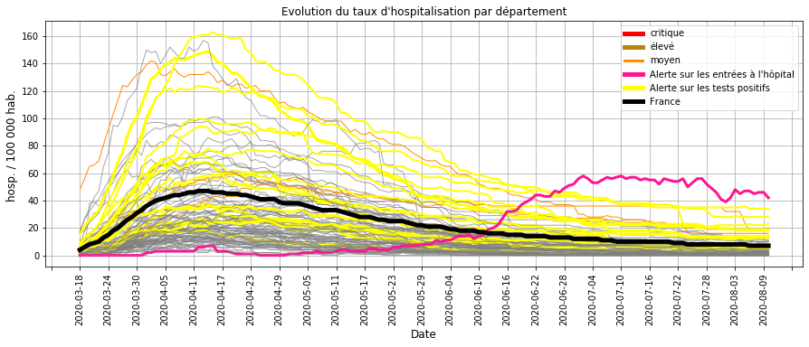
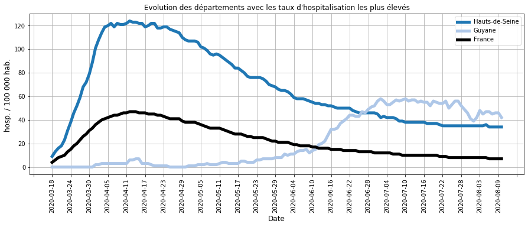
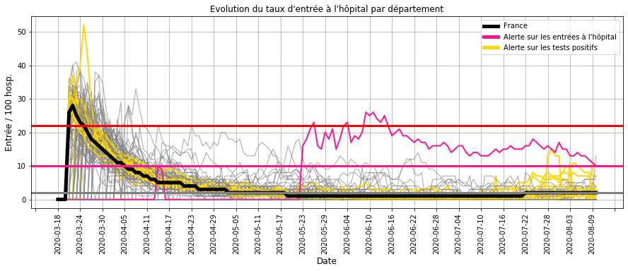
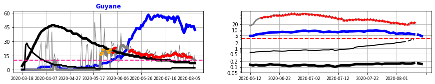
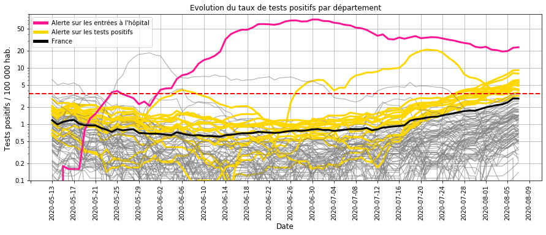
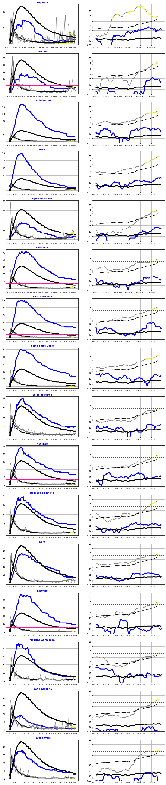
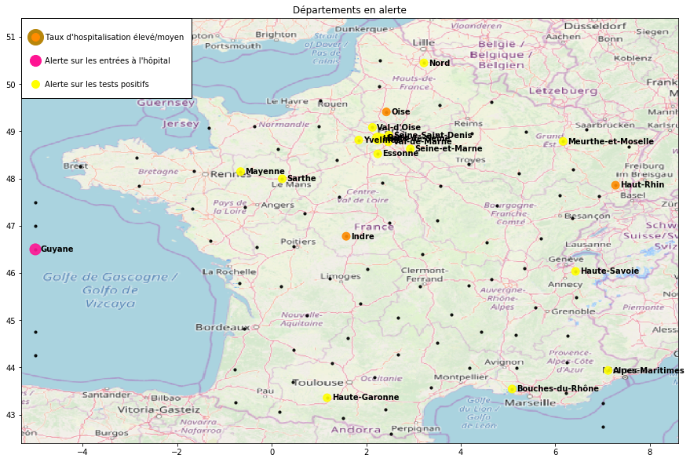

# Surveillance du COVID-19 en France

Bonjour,

L'objectif est de calculer les indicateurs et les modèles qui permettent de surveiller l'évolution de l'épidémie de Covid-19 en France :
- les chapites I,II et III présentent les données utilisées et les principes des calculs.
- les chapitres IV et V (bilan) décrivent l'évolution de l'épidémie et identifient les départements à surveiller.

Une mise à jour hebdomadaire est réalisée à partir des nouvelles données hospitalières et de tests de dépistage.

## I. Origine des données
- nombre quotidien d'hospitalisation, retour à domicile et décès par département (site data.gouv.fr)
- résultat quotidien des tests de dépistage virologiques par département (site data.gouv.fr)
- nombre d'habitant par département

## II. Construction des indicateurs

### Calcul des indicateurs par département
- taux d'hospitalisation (Thosp) : nombre d'hospitalisation pour 100 000 habitants
- taux d'entrée à l'hôpital (Treprod) : nombre d'entrée quotidienne pour 100 hospitalisations
- taux d'entrée à l'hôpital lissé (Treprodmoy) : moyenne sur 3 jours

                                                                           
    

### Classification quotidienne des départements

    Catégories pour le taux d'hospitalisation (/ 100 000 hab.) :
    très bas <  14  < bas <  34  < moyen <  62  < élevé <  104  < très élevé
    
    Catégories pour le taux d'entrée à l'hôpital (/ 100 hosp.)
    bas <  6  < élevé <  16  < très élevé 
    

### Calcul d'une alerte sur le taux d'entrée à l'hôpital
Les conditions :
- le taux d'hospitalisation n'est pas bas (> 14 hosp. / 100 000 hab.)
- le taux d'entrée à l'hôpital est élevé (> 6 entrées / 100 hosp.)

ou
- le taux d'hospitalisation est bas (< 14 hosp. / 100 000 hab.)
- le taux d'entrée à l'hôpital est très élevé (> 16 entrées / 100 hosp)

Cette alerte détecte une accélération de l'épidémie (cf. IV.B.1).

                                                                                         

### III. Relation entre les entrées à l'hôpital et les résultats des tests virologiques.

### Modélisation à partir d'une régression logistique PLS

Le modèle établit la relation entre les entrées à l'hôpital et les tests positifs pour :
- anticiper une hausse des entrées à l'hôpital,
- vérifier que les entrées à l'hôpital sont accompagnées de tests de dépistage.

La relation est établie pendant la phase 1 et 2 du déconfinement (jusqu'au 15 juin) où les tests de dépistage sont en place.

**Les données explicatives** sont les taux de test positif (/ 100 000 hab.) sur les 10 derniers jours précédent l'alerte.

**Les données à prédire** sont la présence d'une alerte sur le taux d'entrée à l'hôpital (> 6 entrées / 100 hosp.).

    
    

    
    

    
    

    
    

### Interprétation du modèle

La modélisation montre que les alertes sur le taux d'entrée à l'hôpital sont liées à 3 facteurs : 
- la moyenne du taux de tests positifs sur les 10 derniers jours,
- la pente pendant ces 10 jours,
- l'allure exponentielle de la croissance.

    
    

    
    

    
    

    
    

    
    

    
    

    
    
    
    

    
    

    
    

### Précision du modèle
- Les alertes sur le taux d'entrée à l'hôpital sont en lien avec les tests positifs sur les 10 derniers jours.
- Lorsque le modèle n'explique par ces alertes, les tests de depistage ont été insuffisants.
- Lorsque le modèle propose des alertes basées sur les tests positifs sans une hausse des entrées hospitalières, celles-ci anticipent une évolution à la hausse.

Ce modèle permettra de surveiller l'évolution de la circulation du virus en France à partir du 15 juin.

## IV. Surveillance des hospitalisations et des tests de dépistage

### A.1 - Taux d'hospitalisation
##### Description :
Le taux d'hospitalisation traduit l'importance de l'épidémie dans un département car il représente la proportion de cas grave en cours d'hospitalisation.

##### Commentaires :
- La majorité des départements (GRIS/ORANGE) ont des valeurs faibles par rapport au pic de l'épidémie de début avril,
- Plusieurs départements (JAUNE) ont un nombre élevé de tests positifs mais un taux d'hospitalisation bas et toujours à la baisse,
- Malgré des entrées encore élevées, la Guyane (ROSE) a un taux d'hospitalisation qui commence à baisser.

### A.2 - Taux d'hospitalisation les plus élevés

##### Commentaires : 
Les départements avec des taux d'hospitalisation élevés sont à la baisse avec des valeurs très inférieures au pic de l'épidémie d'Avril.

### B.1 - Taux d'entrée à l'hôpital
##### Description :
Le taux d'entrée à l'hôpital traduit la dynamique de l'épidémie dans un département.

En effet, le nombre d'hospitalisation est proportionnel (décalé dans le temps) au nombre de contamination et les entrées à l'hôpital au nombre de nouveaux cas.
Plus le rapport entre les entrées à l'hôpital et les hospitalisations est élevé, plus le rapport équivalent entre les nouveaux cas et les contaminations est élevé et donc  plus importante est la transmission du virus.

##### Commentaires :
La comparaison du taux d'entrée à l'hôpital et l'évolution du taux d'hospitalisation (cf. A.1) montre que : 
- le taux d'entrée atteint 20 % au pic de l'épidémie (**limite Rouge**),
- il s'approche des 10 % lorsque l'épidémie repart ou commence à ralentir (**limite Rose**),
- il est inférieur à 5 % lorsque la vitesse de circulation du virus est faible.

Depuis le déconfinement (mai), quelques départements ont ponctuellement un taux qui augmente.

La **Guyane** (en ROSE) a eu un taux élevé entre fin mai et fin juillet avant de baisser.

La hausse des tests positifs dans certains départements (JAUNE) ne se traduit pas par un taux élevé d'entrée à l'hôpital sur plus d'une semaine.

### B-2 - Alerte les entrées à l'hôpital
##### Description :
Le graphique de **gauche** permet de suivre **l'évolution hospitalière** :
- taux d'hospitalisation (BLEU) pour le département / (NOIR EPAIS) pour la France,
- taux d'entrée à l'hôpital (GRIS EPAIS) pour le département / (NOIR FIN) pour la France,
- le trait ROSE est la limite du taux d'entrée où l'épidémie s'accélère.

Le graphique de **droite** permet de suivre les **résultats des tests de dépistage** :
- nombre d'entrée à l'hôpital du département (BLEU) et de la France (NOIR EPAIS) pour 100 000 habitants,
- nombre tests positifs du département (GRIS) et de la la France (NOIR FIN) pour 100 000 habitants.

Les **POINTS ROUGES** représentent les jours où le modèle génère une alerte à partir des tests positifs.

##### Commentaires :
La **Guyane** a eu un taux d'entrée à l'hôpital (GRIS FONCE à gauche) élevé depuis fin mai qui s'est traduit par une forte augmentation du taux d'hospitalisation (BLEU à gauche) au delà du pic épidémique en France (mi-avril).

La baisse du taux d'entrée à l'hôpital depuis juillet (25 à 15 %) et plus fortement depuis début août (10 %) indique que l'épidémie ralentit.

Le nombre élevé de des tests positifs depuis début juin (GRIS à droite) montre que les tests de dépistage sont en place. Leur baisse progressive depuis mi-juillet indique aussi le ralentissement de l'épidémie.

### B-3 - Alerte sur les entrées à l'hôpital sans tests de dépistage massif
##### Description :
L'objectif est de vérifier que les départements dont les taux d'entrée à l'hôpital sont élevés pratiquent des tests massifs de dépistage.

    Aucun département a un taux d'entrée à l'hôpital élevé et un nombre de tests positifs faible.
    

##### Commentaires :

Il faut rappeler que fin mai, l'Allier et la Creuse n'avaient pas fait l'objet de tests de dépistage massifs suite à une recrudescence des entrées à l'hôpital.

### C.1 - Taux de tests virologiques positifs

#### Description :

Il s'agit de surveiller l'évolution du taux de tests virologiques positifs (/100 000 hab.) afin d'anticiper une éventuelle accélération de l'épidémie.

#### Commentaires :
Depuis 3 semaines, de nombreux départements (JAUNE) ont un nombre de tests positifs supérieur à celui du début du déconfinement (début mai).

Cependant, cette hausse ne se traduit pas par une hausse élevée des entrées à l'hôpital.

### C-2 - Alerte sur les tests positifs
##### Description :
L'objectif est de recenser les départements dont les tests positifs augmentent alors que le taux d'entrée à l'hôpital est encore faible.
Cela permet d'anticiper une accélération de l'épidémie.

le graphique de **gauche** permet de suivre **l'évolution hospitalière** :
- taux d'hospitalisation (BLEU) pour le département / (NOIR EPAIS) pour la France,
- taux d'entrée à l'hôpital (GRIS EPAIS) pour le département / (NOIR FIN) pour la France,
- le trait ROSE est la limite du taux d'entrée où l'épidémie s'accélère.

Le graphique de **droite** permet de suivre les **résultats des tests de dépistage** :
- nombre d'entrée à l'hôpital du département (BLEU) et de la France (NOIR EPAIS) pour 100 000 habitants,
- nombre tests positifs du département (GRIS) et de la la France (NOIR FIN) pour 100 000 habitants.

Les **POINTS JAUNE** représentent les jours où le modèle génère une alerte sur les tests positifs.

##### Commentaires :

La **mayenne** a eu une hausse des tests positifs (GRIS à droite) fin juin puis une diminution depuis 2 semaines qui se confirme par une baisse des entrées à l'hôpital (BLEU à droite). Pendant cette période, le taux d'entrée à l'hôpital (GRIS à gauche) est resté bas, ce qui s'est traduit par une croissance lente des hospitalisations. La circulation du virus y a donc été maîtrisée.

**Paris** et les **Alpes-Maritimes** ont une hausse des tests positifs accompagnée d'une hausse des entrées à l'hôpital mais Le taux d'hospitalisation reste actuellement bas. Cette amorce d'accélération sur les cas graves est à surveiller par un dépistage massif.

Pour les autres départements, la hausse des tests positifs ne se traduit pas d'une hausse permanante des entrées. Il n'y a donc pas d'accélération des cas graves.

## V. Bilan sur la circulation du virus au 10 août 2020

Pour de nombreux départements, la hausse depuis 3 semaines des tests virologiques positifs  ne se traduit pas par une accélération des hospitalisations (c'est-à-dire des cas graves). La surveillance de leur tendance doit se poursuivre à travers des tests massifs de dépistage.

La **Guyane** a eu une hausse des hospitalisations depuis fin mai. Des mesures plus strictes depuis juillet les font progressivement baisser. La baisse du nombre de tests positifs confirme cette tendance. L'épidémie ralentit.

Depuis fin juin, la **Mayenne** a eu une hausse des tests positifs sans une croissance élevée des entrées hospitalières. Depuis 2 semaines, le nombre de tests positifs diminue et est accompagné par une baisse des entrées à l'hôpital. Le nombre d'hospitalisation y est donc maîtrisé.

    Merci pour votre attention.
    
