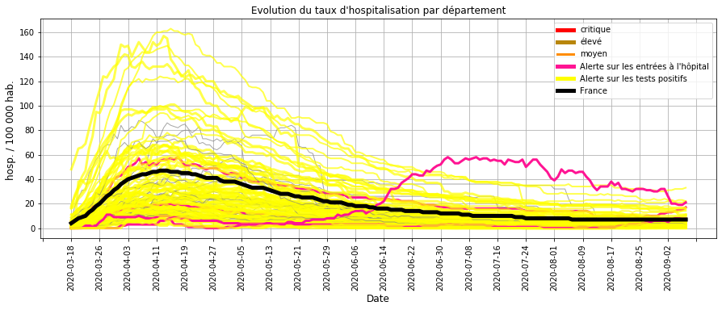
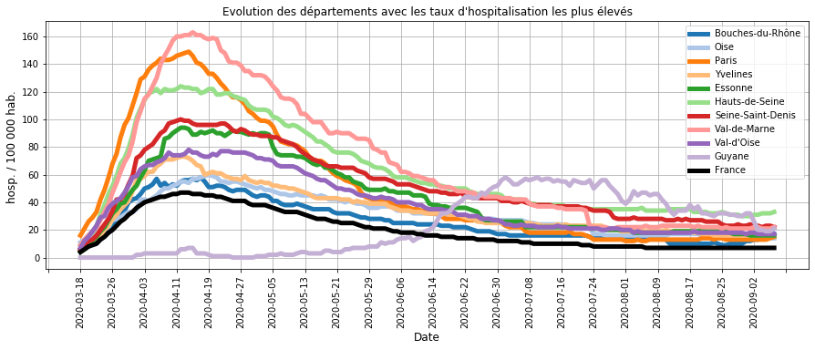
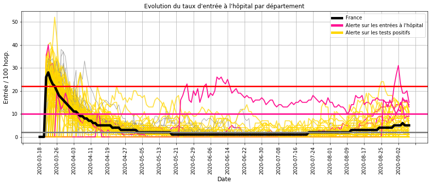
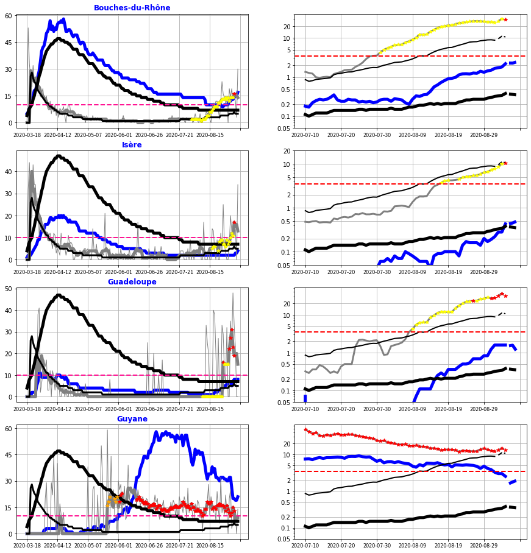
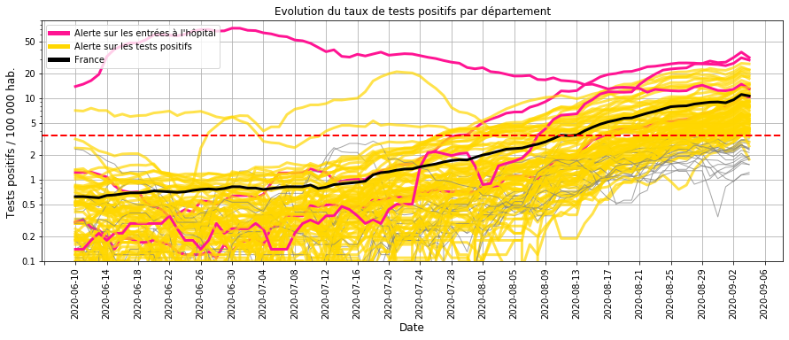
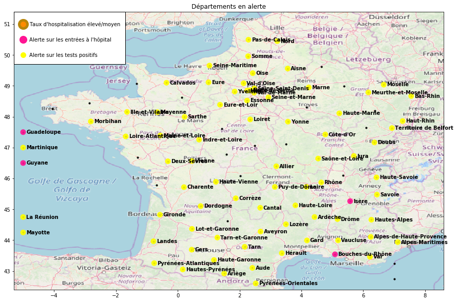

    
    

# Surveillance du COVID-19 en France

Bonjour,

L'objectif est de calculer les indicateurs et les modèles qui permettent de surveiller l'évolution de l'épidémie de Covid-19 en France :
- les chapites I,II et III présentent les données utilisées et les principes des calculs.
- les chapitres IV et V (bilan) décrivent l'évolution de l'épidémie et identifient les départements à surveiller.

Une mise à jour hebdomadaire est réalisée à partir des nouvelles données hospitalières et de tests de dépistage.

## I. Origine des données
- nombre quotidien d'hospitalisation, retour à domicile et décès par département (site data.gouv.fr)
- résultat quotidien des tests de dépistage virologiques par département (site data.gouv.fr)
- nombre d'habitant par département

    c:\users\sylvain_2\appdata\local\programs\python\python37-32\lib\site-packages\IPython\core\interactiveshell.py:3057: DtypeWarning: Columns (0) have mixed types. Specify dtype option on import or set low_memory=False.
      interactivity=interactivity, compiler=compiler, result=result)
    

## II. Construction des indicateurs

### Calcul des indicateurs par département
- taux d'hospitalisation (Thosp) : nombre d'hospitalisation pour 100 000 habitants
- taux d'entrée à l'hôpital (Treprod) : nombre d'entrée quotidienne pour 100 hospitalisations
- taux d'entrée à l'hôpital lissé (Treprodmoy) : moyenne sur 3 jours

                                                                           
    

### Classification quotidienne des départements

    
    

    Catégories pour le taux d'hospitalisation (/ 100 000 hab.) :
    très bas <  14  < bas <  34  < moyen <  62  < élevé <  104  < très élevé
    
    Catégories pour le taux d'entrée à l'hôpital (/ 100 hosp.)
    bas <  6  < élevé <  16  < très élevé 
    

### Calcul d'une alerte sur le taux d'entrée à l'hôpital
Les conditions :
- le taux d'hospitalisation n'est pas bas (> 14 hosp. / 100 000 hab.)
- le taux d'entrée à l'hôpital est élevé (> 6 entrées / 100 hosp.)

ou
- le taux d'hospitalisation est bas (< 14 hosp. / 100 000 hab.)
- le taux d'entrée à l'hôpital est très élevé (> 16 entrées / 100 hosp)

Cette alerte détecte une accélération de l'épidémie (cf. IV.B.1).

                                                                                         

### III. Relation entre les entrées à l'hôpital et les résultats des tests virologiques.

### Modélisation à partir d'une régression logistique PLS

Le modèle établit la relation entre les entrées à l'hôpital et les tests positifs pour :
- anticiper une hausse des entrées à l'hôpital,
- vérifier que les entrées à l'hôpital sont accompagnées de tests de dépistage.

La relation est établie pendant la phase 1 et 2 du déconfinement (jusqu'au 15 juin) où les tests de dépistage sont en place.

**Les données explicatives** sont les taux de test positif (/ 100 000 hab.) sur les 10 derniers jours précédent l'alerte.

**Les données à prédire** sont la présence d'une alerte sur le taux d'entrée à l'hôpital (> 6 entrées / 100 hosp.).

    
    

    
    

    
    

    
    

### Interprétation du modèle

La modélisation montre que les alertes sur le taux d'entrée à l'hôpital sont liées à 3 facteurs : 
- la moyenne du taux de tests positifs sur les 10 derniers jours,
- la pente pendant ces 10 jours,
- l'allure exponentielle de la croissance.

    
    

    
    

    
    

    
    

    
    

    
    

    
    
    
    

    
    

    
    

### Précision du modèle
- Les alertes sur le taux d'entrée à l'hôpital sont en lien avec les tests positifs sur les 10 derniers jours.
- Lorsque le modèle n'explique par ces alertes, les tests de depistage ont été insuffisants.
- Lorsque le modèle propose des alertes basées sur les tests positifs sans une hausse des entrées hospitalières, celles-ci anticipent une évolution à la hausse.

Ce modèle permettra de surveiller l'évolution de la circulation du virus en France à partir du 15 juin.

## IV. Surveillance des hospitalisations et des tests de dépistage

### A.1 - Taux d'hospitalisation
##### Description :
Le taux d'hospitalisation traduit l'importance de l'épidémie dans un département car il représente la proportion de cas grave en cours d'hospitalisation.

##### Commentaires :
- La plupart des départements (JAUNE) ont un nombre élevé de tests positifs mais un taux d'hospitalisation bas par rapport au pic de l'épidémie de début avril,
- Par contre, il commence à apparaitre des départements dont le taux d'entrée à l'hopital est elevé (ROSE) et dont le taux d'hospitalisation est en augmentation.

### A.2 - Taux d'hospitalisation les plus élevés

##### Commentaires : 
La majorité des départements avec des taux d'hospitalisation élevés sont à la baisse avec des valeurs très inférieures au pic de l'épidémie d'Avril.

Seuls les **Bouches du Rhône** et les **Hauts de Seine** ont un taux d'hospitaliation qui réaugmente.

### B.1 - Taux d'entrée à l'hôpital
##### Description :
Le taux d'entrée à l'hôpital traduit la dynamique de l'épidémie dans un département.

En effet, le nombre d'hospitalisation est proportionnel (décalé dans le temps) au nombre de contamination et les entrées à l'hôpital au nombre de nouveaux cas.
Plus le rapport entre les entrées à l'hôpital et les hospitalisations est élevé, plus le rapport équivalent entre les nouveaux cas et les contaminations est élevé et donc  plus importante est la transmission du virus.

##### Commentaires :
La comparaison du taux d'entrée à l'hôpital et l'évolution du taux d'hospitalisation (cf. A.1) montre que : 
- le taux d'entrée atteint 20 % au pic de l'épidémie (**limite Rouge**),
- il s'approche des 10 % lorsque l'épidémie repart ou commence à ralentir (**limite Rose**),
- il est inférieur à 5 % lorsque la vitesse de circulation du virus est faible.

Depuis le déconfinement (mai) et jusqu'à fin juillet, quelques départements ont ponctuellement un taux qui augmente.
Depuis mi-aout, la plupart des départements ont un taux d'entrée qui augmente, tout en restant bas.

Seuls La **Guyane**, les **Bouches du Rhône**, L'**Isère** et la **Guadeloupe** (ROSE) ont un taux d'entrée élevé.

### B-2 - Alerte les entrées à l'hôpital
##### Description :
Le graphique de **gauche** permet de suivre **l'évolution hospitalière** :
- taux d'hospitalisation (BLEU) pour le département / (NOIR EPAIS) pour la France,
- taux d'entrée à l'hôpital (GRIS EPAIS) pour le département / (NOIR FIN) pour la France,
- le trait ROSE est la limite du taux d'entrée où l'épidémie s'accélère.

Le graphique de **droite** permet de suivre les **résultats des tests de dépistage** :
- nombre d'entrée à l'hôpital du département (BLEU) et de la France (NOIR EPAIS) pour 100 000 habitants,
- nombre tests positifs du département (GRIS) et de la la France (NOIR FIN) pour 100 000 habitants.

Les **POINTS ROUGES** représentent les jours où le modèle génère une alerte à partir des tests positifs.

##### Commentaires :
Depuis 10 jours, le taux élevé d'entrées à l'hôpital  **Bouches du Rhône** a entrainé un doublement des hospitalisations. Si cette hausse se poursuit encore 10 jours, le niveau d'hospitalisation se rapprochera du niveau moyen du pic d'épidémie de début avril. Cela montre que les mesures actuelles (gestes barrières et dépistage massif) sont insuffisantes et que des actions plus strictes (confinement ciblé) doivent être mises en place.

La **Guyane** a eu un taux d'entrée à l'hôpital (GRIS FONCE à gauche) élevé depuis fin mai qui s'est traduit par une forte augmentation du taux d'hospitalisation (BLEU à gauche) au delà du pic épidémique en France (mi-avril). La baisse du taux d'entrée à l'hôpital depuis juillet (25 à 15 %) et plus fortement depuis début août (10 %) indique que l'épidémie ralentit.

L'**Isère** et la **Guadeloupe** ont des taux d'entrée à l'hôpital qui augmentent fortement depuis 4 jours (3 septembre)(Gris à gauche) et qui se traduit par une hausse de 50 % des hospitalisations (Bleu à gauche). Une surveillance détaillée dans les deux prochaines semaines est nécessaire pour y confirmer ou non l'accélération de la circulation du virus.

### B-3 - Alerte sur les entrées à l'hôpital sans tests de dépistage massif
##### Description :
L'objectif est de vérifier que les départements dont les taux d'entrée à l'hôpital sont élevés pratiquent des tests massifs de dépistage.

    Aucun département a un taux d'entrée à l'hôpital élevé et un nombre de tests positifs faible.
    

##### Commentaires :

Contrairement au début du déconfinement où des entrées élevées à l'hôpital ne se traduisaient pas systématiquement par une hausse des tests positifs, les tests de dépistage sont généralisés à l'ensemble des départements.

### C.1 - Taux de tests virologiques positifs

#### Description :

Il s'agit de surveiller l'évolution du taux de tests virologiques positifs (pour 100 000 hab.) afin d'anticiper une éventuelle accélération de l'épidémie.

#### Commentaires :
Depuis 3 semaines, la moyenne nationale (NOIR) a un nombre de tests positifs supérieur au seuil d'alerte calculé au  début du déconfinement (début mai). 

Contrairement au début du déconfinement, cette hausse ne se traduit pas systématiquement par une hausse aussi élevée des entrées à l'hôpital.

De plus, l'exemple de la Mayenne (courbe jaune élevée mi juillet) montre qu'une hausse très importante des tests positifs n'a pas générée une hausse importante des entrées à l'hôpital.

C'est pourquoi actuellement, il est difficile d'utiliser cette indicateur comme une alerte qui anticiperait l'accélération des cas graves.

    
    

    
    

## V. Bilan sur la circulation du virus au 7 septembre 2020

Pour de nombreux départements, la hausse généralisée depuis mi-juillet des tests virologiques positifs  ne se traduit pas par une augmentation aussi élevée des hospitalisations (c'est-à-dire des cas graves).

La **Guyane** a eu une hausse des hospitalisations depuis fin mai. Des mesures plus strictes depuis juillet les font progressivement baisser. La baisse du nombre de tests positifs confirme cette tendance. L'épidémie ralentit.

L'**Isère** et la **Guadeloupe** ont depuis 4 jours une hausse très rapide des hospitalisations :
- qui  pour l'instant sont à un niveau très bas,
- mais dont la tendance est à confirmer ou non sur les deux prochaines semaines.

La forte hausse des hospitalisations de l'**Hérault** observée la semaine dernière ne se confirme pas.

Par contre, les **Bouches du Rhône** ont depuis 10 jours une accélération de la circulation du virus. Si cette dynamique se poursuit dans les deux prochaines semaines, le taux d'hospitalisation se rapprocha de la valeur de la moyenne nationale du pic d'épidémie de début avril. Cela montre que les mesures actuelles (gestes barrières et les dépistages massifs) sont insuffisantes :
- pour les autres départements, c'est une alerte pour les renforcer,
- pour les Bouches du Rhône, si on souhaite ne pas se retrouver au niveau de début avril, il semble risquer de ne s'appuyer que sur une amélioration significative de ce type de mesure, contrairement aux mesures plus strictes (confinement ciblé, limitation des interactions sociales) qui ont un effet plus fiable et immédiat.

    Merci pour votre attention.
    
